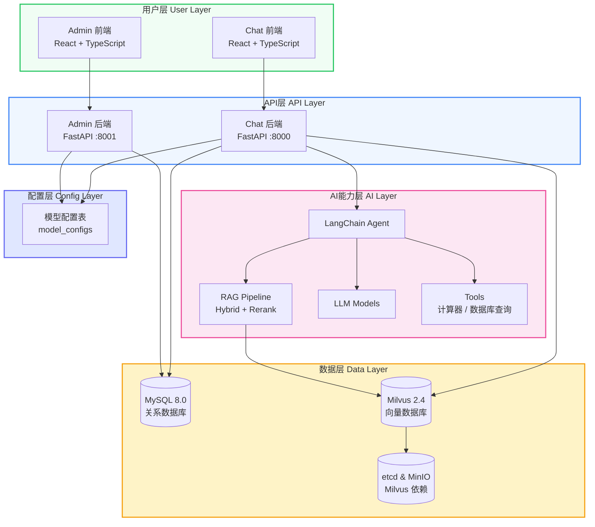
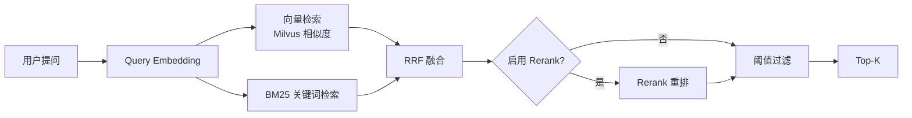

<div align="center">

# MGAgent

### 企业级智能体系统

基于 LangChain + FastAPI + React 构建的企业级智能体解决方案，具备企业级 RAG（Hybrid + Rerank + BM25 + 离线评估）、多租户管理、自然语言数据库查询和动态模型配置

[](LICENSE)
[](https://python.org)
[](https://fastapi.tiangolo.com)
[](https://react.dev)
[](https://docker.com)

[在线文档](https://xmgfy.github.io/MGAgent/) · [快速开始](#-快速开始) · [架构设计](#-架构设计) · [更新日志](https://xmgfy.github.io/MGAgent/blog)

</div>

---

## 项目亮点

- **企业级 RAG** — 多知识库隔离、Hybrid 向量+BM25 RRF 融合、Rerank 重排、检索调试面板、离线评估 (HitRate@k / MRR)
- **动态模型配置** — 所有 LLM / Embedding / Rerank 配置存储于数据库，Admin 端可视化管理，无需重启应用
- **Hybrid 混合检索** — 向量语义检索 + BM25 关键词检索，通过 RRF 融合，`hybrid_alpha` 权重可调
- **可配置分块** — 每个知识库独立的 chunk_size / chunk_overlap / chunk_separator
- **多工具调用** — LangChain Agent 插件化工具体系，支持 API、计算器、SQL 查询等
- **多租户隔离** — 多用户、多知识库、多会话的完整隔离机制
- **一键部署** — Docker Compose 分层架构，MySQL + Milvus + MinIO，脚本化部署

## 架构设计

### 系统架构图



### RAG 流水线



## 核心特性

| 特性 | 说明 |
|------|------|
| **智能对话** | 基于大模型的多轮对话，支持上下文理解、意图识别、流式响应 |
| **多知识库隔离** | 每个知识库独立的分块、Embedding、检索、Rerank 配置，互不干扰 |
| **Hybrid 混合检索** | 向量 + BM25 RRF 融合，`hybrid_alpha` 权重可调，兼顾语义与关键词召回 |
| **Rerank 重排** | 支持 SiliconFlow / Cohere / Jina / OpenAI 兼容接口，按知识库启用 |
| **可配置分块** | chunk_size / chunk_overlap / chunk_separator 按知识库设置 |
| **检索调试** | retrieve-test 面板、RetrievalLog 记录、耗时分解、Hybrid/Rerank 执行标志 |
| **离线评估** | EvalDataset + EvalResult，HitRate@k / MRR 指标 |
| **扩展 Loader** | PDF / Word / TXT / Markdown / Excel / CSV / JSON / 代码文件 |
| **语义分块** | Markdown heading 分块、结构化文档分块 |
| **数据库查询** | 自然语言转 SQL，MySQL 沙箱执行 |
| **多租户管理** | 多用户、多知识库、多会话完整隔离，RBAC 权限控制 |
| **模型配置管理** | Admin 端统一管理 LLM / Embedding / Rerank 配置，数据库存储，动态生效 |

## 技术栈

### 后端

| 技术 | 版本 | 用途 |
|------|------|------|
| Python | 3.10+ | 运行时 |
| FastAPI | 0.100+ | Web 框架 |
| LangChain | 0.2+ | LLM 应用框架 |
| SQLAlchemy | 2.0+ | ORM |
| Uvicorn | 0.20+ | ASGI 服务器 |
| PyJWT | 2.8+ | JWT 认证 |
| bcrypt | 4.0+ | 密码加密 |
| PyMilvus | 2.4+ | Milvus 向量数据库客户端 |

### 前端

| 技术 | 版本 | 用途 |
|------|------|------|
| React | 18 | UI 框架 |
| TypeScript | 5.3+ | 类型安全 |
| Vite | 5.1+ | 构建工具 |
| Tailwind CSS | 3.4+ | 原子化 CSS |
| Framer Motion | 11+ | 动画库 |
| Axios | 1.6+ | HTTP 客户端 |
| Lucide React | 0.314+ | 图标库 |

### 基础设施

| 组件 | 版本 | 用途 |
|------|------|------|
| MySQL | 8.0 | 关系数据库 |
| Milvus | 2.4 | 向量数据库 |
| MinIO | latest | Milvus 对象存储 + 文档存储 |
| etcd | v3.5.5 | Milvus 元数据存储 |
| Attu | v2.4 | Milvus 管理界面 |

## 快速开始

### 方式一：Docker 一键部署（推荐）

```bash
# 1. 克隆项目
git clone https://github.com/xmgfy/MGAgent.git
cd MGAgent

# 2. 配置
cp .env.production.example .env.production

# 3. 一键启动（MySQL + Milvus + 应用层）
chmod +x scripts/deploy.sh
./scripts/deploy.sh up

# 4. 访问
#   Chat 前端:  http://localhost:3000
#   Admin 前端: http://localhost:3001
#   Chat API:   http://localhost:8000/docs
#   Admin API:  http://localhost:8001/docs
#   Attu:       http://localhost:8003
```

### 方式二：本地开发

```bash
# 1. 克隆项目
git clone https://github.com/xmgfy/MGAgent.git
cd MGAgent

# 2. 启动 Docker 基础设施（MySQL + Milvus + etcd + MinIO + Attu）
chmod +x scripts/*.sh
./scripts/docker-services.sh start

# 3. 初始化并启动应用
./scripts/init.sh
./scripts/start-all.sh

# 4. 访问
#   Chat 前端:  http://localhost:5173
#   Admin 前端: http://localhost:5174
```

### 默认账号

```
管理员: admin / admin123
```

## 脚本说明

| 脚本 | 用途 |
|------|------|
| `scripts/init.sh` | 项目初始化，安装依赖、创建目录 |
| `scripts/start-all.sh` | 启动本地开发服务（Chat + Admin 后端、Chat + Admin 前端） |
| `scripts/stop-all.sh` | 停止所有本地服务 |
| `scripts/status.sh` | 检查服务运行状态 |
| `scripts/deploy.sh` | 一键生产部署（MySQL + Milvus + 应用层） |
| `scripts/docker-services.sh` | MySQL + Milvus + etcd + MinIO 基础设施管理 |

> 详细的脚本使用说明请参考 [脚本使用文档](https://xmgfy.github.io/MGAgent/docs/development/scripts)

## 项目结构

```
MGAgent/
├── mgagent-backend/              # Chat 后端服务 (FastAPI :8000)
│   ├── app/
│   │   ├── api/                   # API 路由模块
│   │   ├── rag/                   # RAG 模块（Hybrid + Rerank + BM25）
│   │   ├── db/                    # MySQL 数据库模块
│   │   ├── config/                # 统一配置（MySQL / Milvus / MinIO）
│   │   ├── tools/                 # Agent 工具（计算器、SQL 查询）
│   │   └── ...
│   └── requirements.txt
├── mgagent-admin-backend/         # Admin 后端服务 (FastAPI :8001)
├── mgagent-frontend/              # Chat 前端 (React :5173)
├── mgagent-admin-frontend/        # Admin 前端 (React :5174)
├── docker-compose.infra.yml       # MySQL + Milvus 基础设施
├── docker-compose.prod.yml        # 生产应用层
├── scripts/                       # 工具脚本
└── README.md
```

## 文档

完整的项目文档请访问在线文档站点：

**[https://xmgfy.github.io/MGAgent/](https://xmgfy.github.io/MGAgent/)**

| 文档 | 说明 |
|------|------|
| [快速开始](https://xmgfy.github.io/MGAgent/docs/getting-started/quick-start) | 环境准备与项目启动 |
| [架构概述](https://xmgfy.github.io/MGAgent/docs/architecture/overview) | 系统架构设计与模块划分 |
| [RAG 架构](https://xmgfy.github.io/MGAgent/docs/architecture/rag) | 企业级 RAG 流水线详解 |
| [数据库设计](https://xmgfy.github.io/MGAgent/docs/architecture/database) | MySQL 表结构与 Milvus 集合设计 |
| [模型配置](https://xmgfy.github.io/MGAgent/docs/architecture/model-config) | 动态模型配置管理 |
| [本地开发](https://xmgfy.github.io/MGAgent/docs/deployment/local-development) | 本地开发环境搭建 |
| [Docker 部署](https://xmgfy.github.io/MGAgent/docs/deployment/docker-deployment) | Docker Compose 部署指南 |
| [生产部署](https://xmgfy.github.io/MGAgent/docs/deployment/production-deployment) | 生产环境优化与安全配置 |

## 许可证

[MIT License](LICENSE)

---

<div align="center">

**[在线文档](https://xmgfy.github.io/MGAgent/)** · **[更新日志](https://xmgfy.github.io/MGAgent/blog)** · **[问题反馈](https://github.com/xmgfy/MGAgent/issues)**

Built with ❤️ by MGAgent 核心开发者-小码哥

</div>
