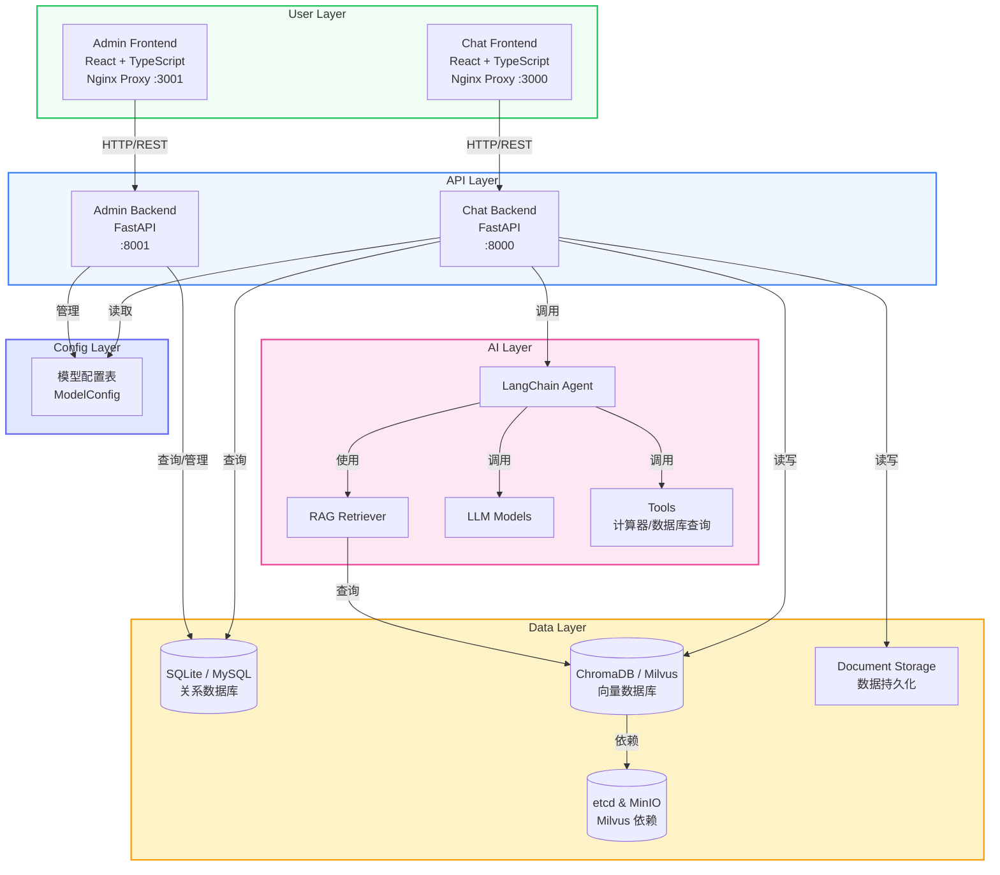
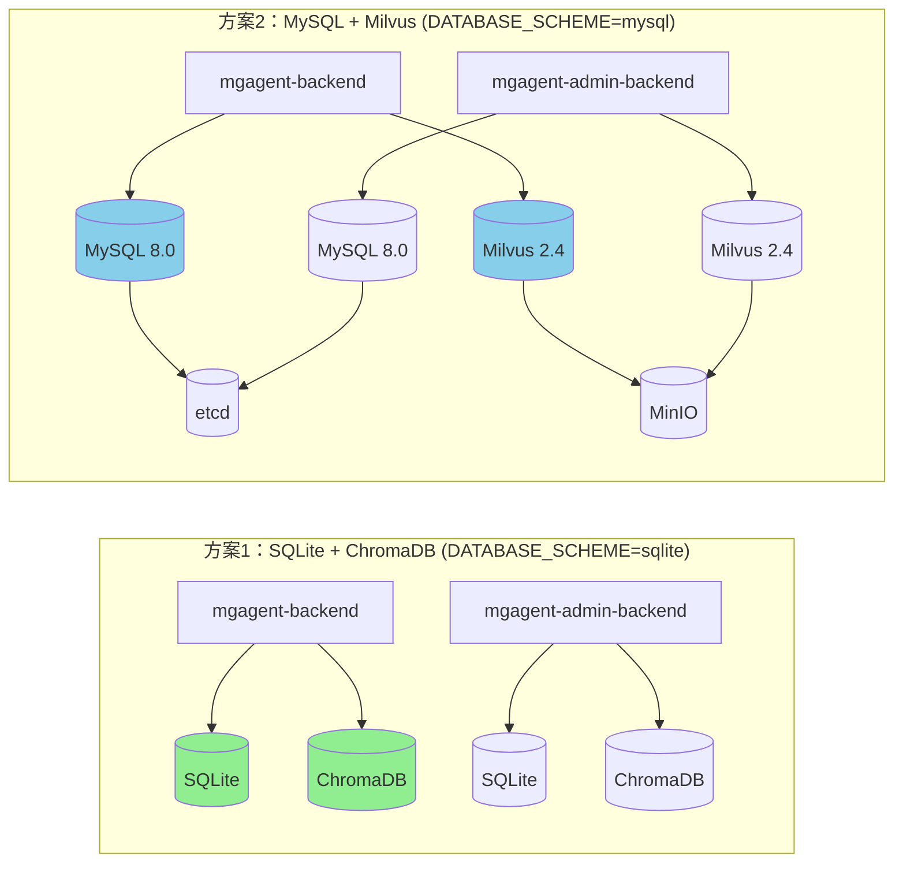

# MGAgent 🤖 - 企业级智能体系统

[](LICENSE)
[](https://www.python.org/)
[](https://nodejs.org/)
[](https://fastapi.tiangolo.com/)
[](https://react.dev/)
[](#-双技术栈架构)

> 🔥 **MGAgent** 是一款面向企业场景的智能体系统，基于 LangChain 框架构建，具备知识库检索、数据分析、多工具调用等核心能力，支持多租户管理和灵活的模型配置。

---

## 📋 目录

- [✨ 功能特性](#-功能特性)
- [🏗️ 架构设计](#-架构设计)
- [🎯 双技术栈架构](#-双技术栈架构)
- [🚀 快速开始](#-快速开始)
- [📷 界面预览](#-界面预览)
- [🔧 技术栈](#-技术栈)
- [📁 项目结构](#-项目结构)
- [📚 文档中心](#-文档中心)
- [🤝 贡献指南](#-贡献指南)
- [📄 许可证](#-许可证)

---

## ✨ 功能特性

### 🎯 核心能力

| 功能 | 描述 |
|------|------|
| **智能对话** | 基于大语言模型的自然语言交互，支持流式响应 |
| **知识库检索** | RAG技术实现企业文档智能检索，支持PDF/TXT/DOCX/MD格式 |
| **数据库查询** | 自动生成SQL查询业务数据，支持表结构查看和数据检索 |
| **计算器** | 内置数学计算工具，处理复杂数值计算 |
| **多工具调用** | Agent自动选择合适的工具完成复杂任务 |

### 🔐 权限管理

- **多租户架构**：支持平台管理员和租户管理员分级管理
- **用户审批**：新用户注册需管理员审批后方可使用
- **角色控制**：平台管理员、租户管理员、普通用户三级权限
- **会话隔离**：用户只能访问自己的对话历史

### ⚙️ 系统管理

- **模型配置**：支持配置多种LLM模型（OpenAI兼容），动态切换
- **模型测试**：一键测试模型连接可用性
- **向量数据库**：支持ChromaDB和Milvus双模式，管理向量数据
- **存储管理**：数据库表结构查看和SQL执行
- **系统监控**：实时监控系统状态和资源使用

---

## 🏗️ 架构设计

### 系统架构图



### 架构特点

1. **双技术栈支持**：同时支持 SQLite+ChromaDB 和 MySQL+Milvus 两套技术栈
2. **前后端分离**：前端和后端完全独立，便于团队协作和技术选型
3. **统一接口抽象**：通过工厂模式实现数据库和向量数据库的统一接口，无缝切换
4. **配置驱动切换**：基于环境变量 `DATABASE_SCHEME` 动态选择技术栈方案
5. **模块化设计**：API按功能模块拆分（auth、users、model、knowledge等）
6. **插件化工具**：Agent工具采用插件化设计，易于扩展新功能
7. **动态模型配置**：所有LLM配置统一从数据库读取和管理，无需静态配置
8. **容器化部署**：支持Docker Compose一键部署，快速搭建完整环境

---

## 🎯 双技术栈架构

MGAgent 支持两套技术栈方案，可根据使用场景灵活选择：

### 方案对比

| 特性 | 方案1：SQLite + ChromaDB | 方案2：MySQL + Milvus |
|------|----------------|----------------|
| **关系数据库** | SQLite | MySQL 8.0 |
| **向量数据库** | ChromaDB | Milvus 2.4 |
| **适用场景** | 轻量级单机部署，适合开发调试 | 高性能生产级部署，适合大规模数据 |
| **部署复杂度** | 简单（无需外部依赖） | 中等（依赖MySQL、Milvus等） |
| **性能** | 单机性能，适合小规模数据 | 高并发，支持大数据量 |
| **配置文件** | docker-compose.local.yml | docker-compose.prod.yml |
| **环境变量** | DATABASE_SCHEME=sqlite | DATABASE_SCHEME=mysql |

### 架构示意图



### 切换机制

#### 1. 环境变量配置

通过设置 `DATABASE_SCHEME` 环境变量来选择技术栈方案：

```bash
# 方案1：SQLite + ChromaDB（默认）
export DATABASE_SCHEME=sqlite

# 方案2：MySQL + Milvus
export DATABASE_SCHEME=mysql
```

#### 2. Docker Compose 配置

```bash
# 方案1：使用 SQLite + ChromaDB 配置
docker compose -f docker-compose.local.yml up -d

# 方案2：使用 MySQL + Milvus 配置
docker compose -f docker-compose.prod.yml up -d
```

#### 3. 代码层面切换

系统通过工厂模式实现数据库和向量数据库的动态切换：

- **数据库工厂** (`app/db/database.py`)：根据 `DATABASE_SCHEME` 选择 SQLite 或 MySQL
- **向量数据库工厂** (`app/rag/vector_factory.py`)：根据 `DATABASE_SCHEME` 选择 ChromaDB 或 Milvus
- **配置模块** (`app/config/config.py`)：集中管理两套方案的配置信息

### 模型配置说明

所有大模型相关的配置（API Key、Base URL、模型名称等）统一从数据库中读取和管理，不再使用本地静态配置。

#### 模型配置表 (model_configs)

| 字段 | 类型 | 说明 |
|------|------|------|
| id | String(64) | 主键 |
| name | String(100) | 配置名称（唯一） |
| api_key | String(500) | API密钥 |
| api_base | String(200) | API基础URL |
| model_name | String(100) | 模型名称 |
| is_active | Boolean | 是否为当前活跃配置 |
| created_at | DateTime | 创建时间 |
| updated_at | DateTime | 更新时间 |

#### 模型配置 API

```bash
# 获取当前活跃的模型配置
GET /model/config

# 获取所有模型配置列表
GET /model/configs

# 创建新的模型配置
POST /model/configs

# 更新模型配置
PUT /model/configs/{config_id}

# 删除模型配置
DELETE /model/configs/{config_id}

# 激活指定的模型配置
POST /model/configs/{config_id}/activate

# 测试模型连接
GET /model/test
```

---

## 🚀 快速开始

### 方式一：一键部署脚本（推荐）

**环境要求：**
- Docker >= 20.10
- Docker Compose >= 2.0

#### 1. 克隆项目

```bash
git clone https://github.com/xmgfy/MGAgent.git
cd MGAgent
```

#### 2. 运行部署脚本

```bash
# 添加执行权限
chmod +x scripts/deploy.sh

# 方式一：交互式选择（推荐）
./scripts/deploy.sh

# 方式二：直接指定方案
./scripts/deploy.sh sqlite    # 启动 SQLite + ChromaDB 方案
./scripts/deploy.sh mysql     # 启动 MySQL + Milvus 方案
```

#### 3. 访问系统

| 服务 | 地址 | 说明 |
|------|------|------|
| Chat 前端 | http://localhost:3000 | 智能客服助手 |
| Admin 前端 | http://localhost:3001 | 管理后台 |
| Chat API | http://localhost:8000 | 后端 API |
| Admin API | http://localhost:8001 | 管理 API |

**MySQL + Milvus 方案额外服务：**
| 服务 | 地址 | 说明 |
|------|------|------|
| Attu | http://localhost:8003 | Milvus 向量库管理 |
| MySQL | localhost:3306 | 关系数据库 |
| Milvus | localhost:19530 | 向量数据库 |

#### 4. 部署脚本命令

```bash
./scripts/deploy.sh sqlite       # 启动 SQLite + ChromaDB 方案
./scripts/deploy.sh mysql        # 启动 MySQL + Milvus 方案
./scripts/deploy.sh stop         # 停止所有服务
./scripts/deploy.sh restart      # 重启服务（交互式选择方案）
./scripts/deploy.sh status       # 查看服务状态
./scripts/deploy.sh logs         # 查看日志
./scripts/deploy.sh cleanup      # 清理所有数据（谨慎使用）
```

#### 5. 默认账号

```
Admin 账号: admin / admin123
数据库账号（MySQL 方案）: mgagent / mgagent_password_2024
```

---

### 方式二：本地开发模式

**环境要求：**
- **Python** >= 3.10
- **Node.js** >= 18
- **npm** >= 9

#### 1. 克隆项目并初始化

```bash
git clone https://github.com/xmgfy/MGAgent.git
cd MGAgent

# 一键初始化（安装所有依赖、创建必要目录）
chmod +x scripts/init.sh && ./scripts/init.sh
```

#### 2. 选择技术栈方案并启动服务

**使用一键脚本（推荐）：**

```bash
# 启动所有服务（默认 SQLite + ChromaDB 方案）
./scripts/start-all.sh

# 停止服务
./scripts/stop-all.sh

# 检查服务状态
./scripts/status.sh
```

**手动启动：**

**方案1：SQLite + ChromaDB**

```bash
# 设置环境变量
export DATABASE_SCHEME=sqlite

# 安装后端依赖
cd mgagent-backend
pip install -r requirements.txt
cd ../mgagent-admin-backend
pip install -r requirements.txt
```

**方案2：MySQL + Milvus**

```bash
# 设置环境变量
export DATABASE_SCHEME=mysql

# 确保 MySQL 和 Milvus 服务已启动
# 修改配置文件或环境变量
export MYSQL_HOST=localhost
export MYSQL_PORT=3306
export MYSQL_USER=mgagent
export MYSQL_PASSWORD=mgagent_password_2024
export MYSQL_DATABASE=mgagent
export MILVUS_HOST=localhost
export MILVUS_PORT=19530

# 安装后端依赖
cd mgagent-backend
pip install -r requirements.txt
cd ../mgagent-admin-backend
pip install -r requirements.txt
```

#### 3. 安装前端依赖

```bash
# 安装 Chat 前端依赖
cd ../mgagent-frontend
npm install

# 安装 Admin 前端依赖
cd ../mgagent-admin-frontend
npm install
```

#### 4. 启动服务

```bash
# Chat 后端
cd mgagent-backend
uvicorn app.main:app --host 0.0.0.0 --port 8000 --reload

# Admin 后端
cd ../mgagent-admin-backend
uvicorn app.main:app --host 0.0.0.0 --port 8001 --reload

# Chat 前端
cd ../mgagent-frontend
npm run dev

# Admin 前端
cd ../mgagent-admin-frontend
npm run dev
```

#### 5. 访问系统

| 服务 | 地址 |
|------|------|
| Chat 前端 | http://localhost:5173 |
| Admin 前端 | http://localhost:5174 |
| Chat API | http://localhost:8000 |
| Admin API | http://localhost:8001 |

#### 6. 配置模型

登录 Admin 后台后，在**模型管理**页面配置您的 LLM 模型：

1. 点击"新增模型"
2. 填写模型名称、API Key、API Base URL
3. 点击"测试连接"验证配置
4. 点击"启用"使模型生效

> **重要**：所有大模型配置统一在 Admin 后台管理和存储，不再使用本地静态配置文件。模型配置存储在数据库的 `model_configs` 表中，支持多套配置和动态切换。

---

### 方式三：Docker Compose 直接部署

```bash
# 方案1：SQLite + ChromaDB
docker compose -f docker-compose.local.yml up -d --build

# 方案2：MySQL + Milvus
docker compose -f docker-compose.prod.yml up -d --build
```

---

## 📷 界面预览

### 🎨 Chat 前端界面


**功能特点**：
- 会话管理：支持创建、查看、删除对话
- 文件上传：支持 PDF/TXT/DOCX/MD 格式文件作为对话上下文
- 匿名使用：未登录用户可免费使用3次
- 用户认证：登录后可查看完整对话历史

### 🖥️ Admin 管理后台


**功能特点**：
- 用户审批：管理新用户注册申请
- 模型管理：配置和切换LLM模型
- 知识库管理：上传和管理企业文档
- 系统监控：查看系统状态和资源使用

### 📊 模型管理界面


**功能特点**：
- 支持配置多个模型
- 一键测试模型连接
- 动态切换活跃模型
- 无需重启服务即可生效

### 📚 知识库管理界面


**功能特点**：
- 支持多种文档格式上传
- 自动进行文本分割和向量化
- 支持文档搜索和预览
- 文档状态实时追踪

### 🗄️ 数据库管理界面

系统会根据当前技术栈方案动态展示数据库信息：

**SQLite 模式**：
- 显示数据库文件路径
- 显示数据文件大小
- 提供数据库表结构查看

**MySQL 模式**：
- 显示数据库主机地址
- 显示数据库端口
- 显示数据库名称
- 提供数据库连接状态检查

### 🔍 向量数据库管理界面

系统会根据当前技术栈方案动态展示向量数据库信息：

**ChromaDB 模式**：
- 显示数据持久化路径
- 显示向量数据统计
- 提供向量块管理功能

**Milvus 模式**：
- 显示 Milvus 主机地址
- 显示 Milvus 端口
- 显示集合名称
- 提供向量检索和管理功能

---

## 🔧 技术栈

### 后端技术

| 技术 | 版本 | 用途 |
|------|------|------|
| **FastAPI** | >= 0.100 | 高性能异步API框架 |
| **LangChain** | >= 0.2 | LLM应用开发框架 |
| **LangChain OpenAI** | >= 0.1 | OpenAI模型集成 |
| **SQLite** | 3.x | SQLite方案关系数据库 |
| **MySQL** | 8.0 | MySQL方案关系数据库 |
| **ChromaDB** | 0.4+ | SQLite方案向量数据库 |
| **Milvus** | 2.4 | MySQL方案向量数据库 |
| **SQLAlchemy** | >= 2.0 | ORM数据库操作 |
| **PyJWT** | >= 2.8 | JWT认证 |
| **bcrypt** | >= 4.0 | 密码加密 |
| **PyMySQL** | >= 1.1 | MySQL驱动 |

### 前端技术

| 技术 | 版本 | 用途 |
|------|------|------|
| **React** | 18 | UI框架 |
| **TypeScript** | 5 | 类型安全 |
| **Tailwind CSS** | 3 | 样式框架 |
| **Framer Motion** | 11 | 动画效果 |
| **Lucide React** | 0.314 | 图标库 |
| **Axios** | 1.6 | HTTP客户端 |
| **Vite** | 5 | 构建工具 |
| **Nginx** | latest | 前端部署与API代理 |

### 部署技术

| 技术 | 版本 | 用途 |
|------|------|------|
| **Docker** | >= 20.10 | 容器化 |
| **Docker Compose** | >= 2.0 | 服务编排 |
| **etcd** | v3.5.5 | Milvus 元数据存储 |
| **MinIO** | latest | Milvus 对象存储 |
| **Attu** | v2.4 | Milvus 管理界面 |

---

## 📁 项目结构

```
MGAgent/
├── mgagent-backend/           # Chat 后端
│   ├── app/
│   │   ├── api/              # API路由
│   │   ├── agent/            # Agent核心逻辑
│   │   ├── config/           # 配置模块（支持双方案切换）
│   │   ├── rag/              # RAG模块（含向量数据库工厂）
│   │   ├── services/        # 业务服务（含模型配置服务）
│   │   ├── tools/            # 工具集
│   │   └── db/               # 数据库工厂和模型
│   ├── data/                 # 数据存储目录
│   ├── Dockerfile            # Docker 构建文件
│   └── requirements.txt
├── mgagent-frontend/          # Chat 前端
│   ├── src/
│   │   ├── components/        # UI组件
│   │   ├── api/client.ts     # API客户端
│   │   └── App.tsx           # 主应用
│   ├── Dockerfile            # Docker 构建文件
│   └── package.json
├── mgagent-admin-backend/     # Admin 后端
│   ├── app/
│   │   ├── api/              # API路由
│   │   ├── config/           # 配置模块（支持双方案切换）
│   │   ├── rag/              # RAG模块（含向量数据库工厂）
│   │   └── db/               # 数据库工厂和模型
│   ├── Dockerfile            # Docker 构建文件
│   └── requirements.txt
├── mgagent-admin-frontend/    # Admin 前端
│   ├── src/
│   │   ├── pages/            # 页面组件
│   │   ├── components/       # UI组件
│   │   └── api/client.ts     # API客户端
│   ├── Dockerfile            # Docker 构建文件
│   └── package.json
├── docker/                    # Docker 相关配置
│   └── mysql/
│       └── init.sql          # MySQL 初始化脚本
├── scripts/                  # 工具脚本（统一归档）
│   ├── init.sh               # 一键初始化
│   ├── start-all.sh          # 一键启动本地服务
│   ├── stop-all.sh           # 一键停止本地服务
│   ├── status.sh             # 服务状态检查
│   ├── deploy.sh             # 一键 Docker 部署
│   ├── docker-services.sh    # Docker 数据库服务管理
│   ├── migrate_data.py       # 数据迁移脚本
│   └── git-sync.sh           # Git 同步工具（本地，已忽略）
├── docs/                      # 文档目录
│   ├── scripts.md            # 脚本使用指南
│   ├── migration-guide.md    # 数据迁移指南
│   └── images/               # 截图资源
├── docker-compose.local.yml   # 方案1：SQLite + ChromaDB 配置
├── docker-compose.prod.yml    # 方案2：MySQL + Milvus 配置
├── .env.example               # 环境变量模板
└── README.md
```

### 关键文件说明

| 文件 | 说明 |
|------|------|
| `app/config/config.py` | 统一配置模块，支持 `DATABASE_SCHEME` 切换 |
| `app/db/database.py` | 数据库工厂，动态创建 SQLite 或 MySQL 引擎 |
| `app/rag/vector_factory.py` | 向量数据库工厂，动态创建 ChromaDB 或 Milvus 实例 |
| `app/services/model_config_service.py` | 模型配置服务，从数据库读取和管理模型配置 |
| `docker-compose.local.yml` | SQLite + ChromaDB 方案 Docker Compose 配置 |
| `docker-compose.prod.yml` | MySQL + Milvus 方案 Docker Compose 配置 |
| `scripts/deploy.sh` | 一键 Docker 部署脚本 |
| `scripts/init.sh` | 一键项目初始化脚本 |
| `scripts/start-all.sh` | 本地开发一键启动脚本 |
| `scripts/docker-services.sh` | Docker 数据库服务管理脚本 |

---

## 📚 文档中心

| 文档 | 说明 |
|------|------|
| [scripts.md](docs/scripts.md) | 脚本使用指南：详细介绍所有脚本的使用方法和适用场景 |
| [migration-guide.md](docs/migration-guide.md) | 数据迁移指南：从 SQLite 迁移到 MySQL / Milvus 的完整步骤 |

### 脚本使用速查

```bash
# 首次初始化
./scripts/init.sh

# 本地开发（SQLite + ChromaDB）
./scripts/start-all.sh       # 启动服务
./scripts/stop-all.sh        # 停止服务
./scripts/status.sh          # 检查状态

# Docker 数据库服务
./scripts/docker-services.sh setup-mirror   # 配置国内镜像源
./scripts/docker-services.sh start          # 启动 MySQL + Milvus

# 生产部署（Docker Compose）
./scripts/deploy.sh sqlite   # SQLite + ChromaDB 方案
./scripts/deploy.sh mysql    # MySQL + Milvus 方案
./scripts/deploy.sh status   # 查看部署状态
./scripts/deploy.sh stop     # 停止所有服务
```

> 💡 详细的脚本使用说明和完整流程请参考 [scripts.md](docs/scripts.md)。

---

## 🤝 贡献指南

我们欢迎所有形式的贡献！如果你想为 MGAgent 做出贡献，请遵循以下步骤：

### 贡献流程

1. **Fork 项目**：点击右上角的 Fork 按钮
2. **创建分支**：`git checkout -b feature/your-feature`
3. **提交代码**：`git commit -m "feat: add your feature"`
4. **推送分支**：`git push origin feature/your-feature`
5. **创建 PR**：在 GitHub 上创建 Pull Request

### 代码规范

- **Python**：遵循 PEP 8 规范
- **TypeScript/React**：遵循 ESLint 规则
- **提交信息**：使用 Conventional Commits 格式

### 开发环境

```bash
# 安装 pre-commit 钩子
pip install pre-commit
pre-commit install
```

---

## 📝 更新日志

### v2.3.0 (2026-07-28)

#### 🎉 重大更新：脚本规范化与文档体系

- **脚本统一归档**：将所有工具脚本（`init.sh`、`start-all.sh`、`stop-all.sh`、`status.sh`、`deploy.sh`、`git-sync.sh`）统一迁移至 `scripts/` 目录
- **路径自适配**：所有脚本内部路径引用重新适配，无论在哪个目录执行都能正确定位项目根目录
- **文档体系建立**：新增 `docs/scripts.md`，详细描述每个脚本的使用方法、适用场景和完整流程
- **文档中心**：README 新增"文档中心"章节，集中管理所有项目文档
- **Git 同步工具忽略**：`git-sync.sh` 加入 `.gitignore`，不再纳入版本控制

#### ✨ 新增功能

- **脚本使用速查**：README 内置脚本快速参考卡片，方便日常查阅
- **完整路线图**：文档中包含本地开发和生产部署两条完整使用路线图

#### 🔧 优化改进

- **前端错误提示优化**：Admin 管理台新增 Toast 通知组件，模型配置操作均有友好提示
- **后端即时感知**：模型配置变更后，向量检索器自动检测并重新加载嵌入模型
- **Docker 镜像加速**：新增国内 Docker 镜像源配置，支持镜像预热和多源代理拉取
- **脚本健壮性**：`docker-services.sh` 修复 macOS 环境下 `timeout` 命令不可用的问题

---

### v2.2.0 (2026-07-28)

#### 🎉 重大更新：动态模型配置

- **移除 LLM 静态配置**：所有大模型相关的配置（API Key、Base URL、模型名称等）统一从数据库中读取和加载
- **新增模型配置服务** (`model_config_service.py`)：提供完整的模型配置 CRUD 操作
- **模型配置 API**：新增模型配置的增删改查接口，支持多套配置和动态切换
- **配置驱动架构**：Chat 后端运行时从数据库获取模型配置，支持热更新

#### ✨ 新增功能

- **模型配置表** (`model_configs`)：存储模型配置信息
- **模型配置服务** (`app/services/model_config_service.py`)：管理模型配置的读写
- **模型管理 API**：
  - `GET /model/config`：获取当前活跃的模型配置
  - `GET /model/configs`：获取所有模型配置列表
  - `POST /model/configs`：创建新的模型配置
  - `PUT /model/configs/{id}`：更新模型配置
  - `DELETE /model/configs/{id}`：删除模型配置
  - `POST /model/configs/{id}/activate`：激活指定的模型配置

#### 🔧 优化改进

- **配置命名优化**：将 `local`/`production` 方案命名改为 `sqlite`/`mysql`
- **配置统一管理**：Admin 后台模型管理页面改为直接操作数据库
- **代码解耦**：移除代码中对静态 LLM 配置的依赖

---

### v2.1.0 (2026-07-28)

#### 🎉 重大更新：双技术栈架构支持

- **双技术栈架构**：支持 SQLite+ChromaDB 和 MySQL+Milvus 两套技术栈
- **配置驱动切换**：基于 `DATABASE_SCHEME` 环境变量动态选择技术栈方案
- **工厂模式实现**：通过数据库工厂和向量数据库工厂实现统一接口抽象
- **一键部署脚本**：新增 `deploy.sh` 脚本，支持交互式方案选择

#### ✨ 新增功能

- **数据库方案枚举** (`DatabaseScheme`)：定义 `sqlite` 和 `mysql` 两种方案
- **数据库工厂** (`app/db/database.py`)：动态创建 SQLite 或 MySQL 引擎
- **向量数据库接口** (`VectorDBInterface`)：统一的向量数据库抽象接口
- **ChromaDB 服务** (`ChromaDBService`)：SQLite 方案的向量数据库实现
- **Milvus 服务** (`MilvusService`)：MySQL 方案的向量数据库实现
- **两套 Docker Compose 配置**：
  - `docker-compose.local.yml`：SQLite + ChromaDB 方案
  - `docker-compose.prod.yml`：MySQL + Milvus 方案

#### 🔧 优化改进

- **统一配置模块**：重构配置模块，支持双方案的所有配置项
- **Admin 后台动态展示**：管理台根据当前方案展示对应的数据库和向量数据库信息
- **健康检查增强**：健康检查接口返回当前技术栈方案信息

---

### v2.0.0 (2026-07-27)

#### 🎉 重大更新

- **数据源升级**：从 SQLite 迁移到 MySQL 8.0，提升数据存储可靠性
- **向量数据库升级**：从 ChromaDB 迁移到 Milvus 2.4，支持更高性能的向量检索
- **Docker 部署支持**：新增 Docker Compose 一键部署，支持全栈容器化
- **一键部署脚本**：新增 `deploy.sh` 脚本，简化部署流程

#### ✨ 新增功能

- **Dockerfile**：为所有应用模块创建 Docker 构建文件
- **Nginx 配置**：前端 API 请求代理到后端服务
- **docker-compose.yml**：统一编排所有服务
- **MySQL 初始化脚本**：数据库表结构自动创建
- **.env 配置文件**：环境变量集中管理

#### 🔧 优化改进

- **数据库连接池**：MySQL 连接池配置优化，提升并发性能
- **健康检查**：所有服务配置健康检查，确保服务可用性
- **数据卷持久化**：数据库和文件存储数据持久化
- **容器网络**：统一容器网络通信，简化服务间调用

---

### v1.0.0 (2026-07-26)

#### 🚀 初始版本

- 实现多租户智能体系统基础功能
- 支持智能对话、知识库检索、数据库查询等核心能力
- 完成 Chat 前端和 Admin 管理后台开发
- 实现用户审批、权限管理、模型配置等功能

---

## 📄 许可证

MGAgent 采用 MIT 许可证，详见 [LICENSE](LICENSE) 文件。

---

## 📞 联系方式

如有问题或建议，欢迎通过以下方式联系我们：

- 📧 邮箱：gqq1185805174@gmail.com
- 🐙 GitHub：[https://github.com/xmgfy/MGAgent](https://github.com/xmgfy/MGAgent)

---

**如果这个项目对你有帮助，请给我们一个 ⭐ Star！**

Made with ❤️ by the MGAgent Team
