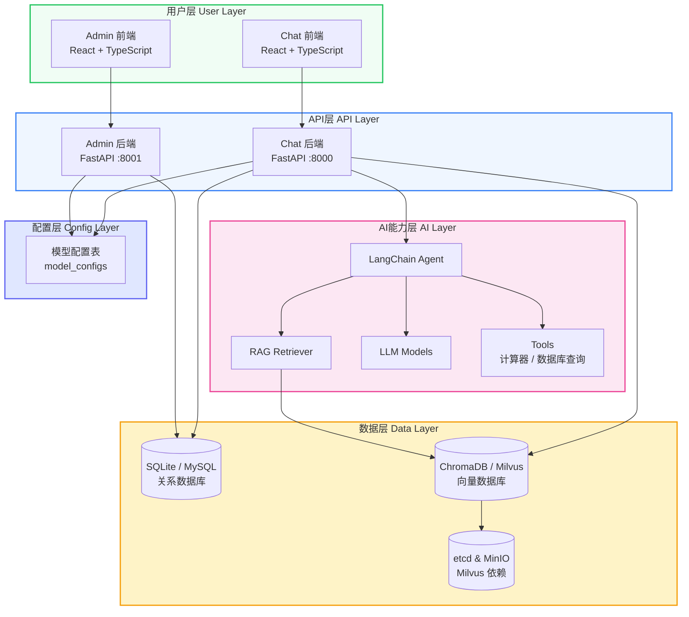

<div align="center">

# MGAgent

### 企业级智能体系统

基于 LangChain + FastAPI + React 构建的企业级智能体解决方案，支持双技术栈架构、多租户管理、RAG 知识库检索和动态模型配置

[](LICENSE)
[](https://python.org)
[](https://fastapi.tiangolo.com)
[](https://react.dev)
[](https://docker.com)

[在线文档](https://xmgfy.github.io/MGAgent/) · [快速开始](#-快速开始) · [架构设计](#-架构设计) · [更新日志](https://xmgfy.github.io/MGAgent/blog)

</div>

---

## 项目亮点

- **双技术栈架构** — 独创统一接口抽象，开发用 SQLite+ChromaDB，生产用 MySQL+Milvus，零代码切换
- **动态模型配置** — 所有 LLM 配置存储于数据库，Admin 端可视化管理，无需重启应用
- **RAG 知识库** — 向量检索增强，支持文档上传、自动分片、语义召回
- **多工具调用** — LangChain Agent 插件化工具体系，支持 API、计算器、数据库查询等
- **多租户隔离** — 多用户、多知识库、多会话的完整隔离机制
- **一键部署** — Docker Compose 分层架构，脚本化部署，开箱即用

## 架构设计

### 系统架构图



### 双技术栈架构

| 特性 | 方案1：SQLite + ChromaDB | 方案2：MySQL + Milvus |
|------|--------------------------|------------------------|
| 关系数据库 | SQLite 3.x（文件型，零配置） | MySQL 8.0（高性能，支持并发） |
| 向量数据库 | ChromaDB 0.5+（轻量嵌入式） | Milvus 2.4（分布式，亿级向量） |
| 适用场景 | 本地开发调试、单机部署 | 生产环境、大规模数据、高并发 |
| 外部依赖 | 无 | MySQL、Milvus、etcd、MinIO |
| 环境变量 | `.env.sqlite` | `.env.mysql` |
| Compose 文件 | 无需 Docker | `docker-compose.infra.yml` |

> 两套方案下，Chat 后端和 Admin 后端连接的是**同一套数据库和向量数据库**，确保数据一致性。

## 核心特性

| 特性 | 说明 |
|------|------|
| **智能对话** | 基于大模型的多轮对话，支持上下文理解、意图识别、流式响应 |
| **知识库检索** | RAG 向量检索增强，支持 PDF/Word/TXT 文档上传与自动分片 |
| **数据库查询** | 自然语言转 SQL，支持安全沙箱执行和数据可视化 |
| **多工具调用** | LangChain Agent 插件化工具，支持 API 调用、计算器、搜索等 |
| **多租户管理** | 多用户、多知识库、多会话完整隔离，RBAC 权限控制 |
| **模型配置管理** | Admin 端统一管理 LLM 配置，数据库存储，动态生效，无需重启 |

## 技术栈

### 后端

| 技术 | 版本 | 用途 |
|------|------|------|
| Python | 3.10+ | 运行时 |
| FastAPI | 0.100+ | Web 框架 |
| LangChain | 0.2+ | LLM 应用框架 |
| SQLAlchemy | 2.0+ | ORM |
| Uvicorn | 0.20+ | ASGI 服务器 |
| PyJWT | 2.8+ | JWT 认证 |
| ChromaDB | 0.5+ | 轻量向量数据库 |
| PyMilvus | 2.4+ | 分布式向量数据库客户端 |

### 前端

| 技术 | 版本 | 用途 |
|------|------|------|
| React | 18 | UI 框架 |
| TypeScript | 5.3+ | 类型安全 |
| Vite | 5.1+ | 构建工具 |
| Tailwind CSS | 3.4+ | 原子化 CSS |
| Framer Motion | 11+ | 动画库 |
| Axios | 1.6+ | HTTP 客户端 |
| Lucide React | 0.314+ | 图标库 |

## 快速开始

### 方式一：本地开发（SQLite 方案，推荐）

```bash
# 1. 克隆项目
git clone https://github.com/xmgfy/MGAgent.git
cd MGAgent

# 2. 一键初始化环境
./scripts/init.sh

# 3. 启动所有服务（SQLite 模式）
./scripts/start-all.sh sqlite

# 4. 访问应用
#   Chat 前端:  http://localhost:5173
#   Admin 前端: http://localhost:5174
#   Chat API:   http://localhost:8000/docs
#   Admin API:  http://localhost:8001/docs
```

### 方式二：本地开发（MySQL 方案）

```bash
# 1. 克隆项目
git clone https://github.com/xmgfy/MGAgent.git
cd MGAgent

# 2. 一键初始化环境
./scripts/init.sh

# 3. 启动 Docker 基础设施（MySQL + Milvus）
./scripts/docker-services.sh start

# 4. 启动所有服务（MySQL 模式）
./scripts/start-all.sh mysql

# 5. 访问应用
#   Chat 前端:  http://localhost:5173
#   Admin 前端: http://localhost:5174
```

## 脚本说明

| 脚本 | 用途 |
|------|------|
| `scripts/init.sh` | 项目初始化，安装依赖、创建目录、设置权限 |
| `scripts/start-all.sh` | 启动所有服务，支持 `sqlite` / `mysql` 模式 |
| `scripts/stop-all.sh` | 停止所有服务 |
| `scripts/status.sh` | 查看所有服务运行状态 |
| `scripts/docker-services.sh` | Docker 基础设施服务管理（MySQL + Milvus） |

> 详细的脚本使用说明请参考 [脚本使用文档](https://xmgfy.github.io/MGAgent/docs/development/scripts)

## 项目结构

```
MGAgent/
├── mgagent-backend/              # Chat 后端服务 (FastAPI :8000)
│   ├── app/
│   │   ├── api/                  # API 路由模块
│   │   ├── core/                 # 核心配置与工厂模式
│   │   ├── exceptions/           # 自定义异常体系
│   │   ├── models/               # 数据模型
│   │   ├── schemas/              # Pydantic 请求/响应模型
│   │   ├── services/             # 业务逻辑层
│   │   └── agent/                # LangChain Agent 与工具
│   ├── .env.sqlite               # SQLite 模式配置
│   ├── .env.mysql                # MySQL 模式配置
│   └── requirements.txt
├── mgagent-admin-backend/        # Admin 后端服务 (FastAPI :8001)
│   ├── app/
│   ├── .env.sqlite               # SQLite 模式配置
│   ├── .env.mysql                # MySQL 模式配置
│   └── requirements.txt
├── mgagent-frontend/             # Chat 前端 (React :5173)
│   └── src/
├── mgagent-admin-frontend/       # Admin 前端 (React :5174)
│   └── src/
├── docker-compose.infra.yml      # MySQL + Milvus 基础设施
├── scripts/                      # 工具脚本
├── website/                      # Docusaurus 在线文档站点
├── docs/                         # 项目文档
└── README.md
```

## 文档

完整的项目文档请访问在线文档站点：

**[https://xmgfy.github.io/MGAgent/](https://xmgfy.github.io/MGAgent/)**

| 文档 | 说明 |
|------|------|
| [快速开始](https://xmgfy.github.io/MGAgent/docs/getting-started/quick-start) | 环境准备与项目启动 |
| [架构概述](https://xmgfy.github.io/MGAgent/docs/architecture/overview) | 系统架构设计与模块划分 |
| [双技术栈架构](https://xmgfy.github.io/MGAgent/docs/architecture/dual-stack) | SQLite/MySQL 切换机制 |
| [模型配置](https://xmgfy.github.io/MGAgent/docs/architecture/model-config) | 动态模型配置管理 |
| [本地开发](https://xmgfy.github.io/MGAgent/docs/deployment/local-development) | 本地开发环境搭建 |
| [Docker 部署](https://xmgfy.github.io/MGAgent/docs/deployment/docker-deployment) | Docker 容器化部署 |
| [MySQL 部署](https://xmgfy.github.io/MGAgent/docs/deployment/mysql-deployment) | MySQL + Milvus 生产部署 |
| [更新日志](https://xmgfy.github.io/MGAgent/blog) | 按月发布的项目更新记录 |

## 环境变量

不同模式使用不同的环境配置文件：

- **SQLite 模式**：`.env.sqlite`
- **MySQL 模式**：`.env.mysql`

`start-all.sh` 会根据启动模式自动复制对应的配置文件为 `.env`。

> 大模型相关配置已**全部迁移至数据库**，通过 Admin 端管理，不再使用本地静态配置。

## 许可证

[MIT License](LICENSE)

---

<div align="center">

**[在线文档](https://xmgfy.github.io/MGAgent/)** · **[更新日志](https://xmgfy.github.io/MGAgent/blog)** · **[问题反馈](https://github.com/xmgfy/MGAgent/issues)**

Built with ❤️ by MGAgent 核心开发者-小码哥

</div>
