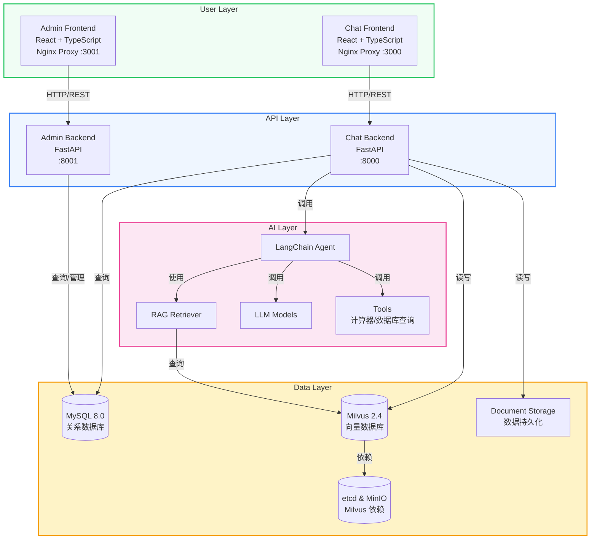

# MGAgent 🤖 - 企业级智能体系统

[](LICENSE)
[](https://www.python.org/)
[](https://nodejs.org/)
[](https://fastapi.tiangolo.com/)
[](https://react.dev/)

> 🔥 **MGAgent** 是一款面向企业场景的智能体系统，基于 LangChain 框架构建，具备知识库检索、数据分析、多工具调用等核心能力，支持多租户管理和灵活的模型配置。

---

## 📋 目录

- [✨ 功能特性](#-功能特性)
- [🏗️ 架构设计](#-架构设计)
- [🚀 快速开始](#-快速开始)
- [📷 界面预览](#-界面预览)
- [🔧 技术栈](#-技术栈)
- [📁 项目结构](#-项目结构)
- [🤝 贡献指南](#-贡献指南)
- [📄 许可证](#-许可证)

---

## ✨ 功能特性

### 🎯 核心能力

| 功能 | 描述 |
|------|------|
| **智能对话** | 基于大语言模型的自然语言交互，支持流式响应 |
| **知识库检索** | RAG技术实现企业文档智能检索，支持PDF/TXT/DOCX/MD格式 |
| **数据库查询** | 自动生成SQL查询业务数据，支持表结构查看和数据检索 |
| **计算器** | 内置数学计算工具，处理复杂数值计算 |
| **多工具调用** | Agent自动选择合适的工具完成复杂任务 |

### 🔐 权限管理

- **多租户架构**：支持平台管理员和租户管理员分级管理
- **用户审批**：新用户注册需管理员审批后方可使用
- **角色控制**：平台管理员、租户管理员、普通用户三级权限
- **会话隔离**：用户只能访问自己的对话历史

### ⚙️ 系统管理

- **模型配置**：支持配置多种LLM模型（OpenAI兼容），动态切换
- **模型测试**：一键测试模型连接可用性
- **向量数据库**：管理Chroma向量库，支持数据查看和搜索
- **存储管理**：数据库表结构查看和SQL执行
- **系统监控**：实时监控系统状态和资源使用

---

## 🏗️ 架构设计



### 架构特点

1. **前后端分离**：前端和后端完全独立，便于团队协作和技术选型
2. **共享数据库**：Chat后端和Admin后端共享同一个MySQL数据库，保证数据一致性
3. **向量化升级**：使用Milvus替代ChromaDB，支持更高性能的向量检索
4. **模块化设计**：API按功能模块拆分（auth、users、model、knowledge等）
5. **插件化工具**：Agent工具采用插件化设计，易于扩展新功能
6. **动态模型配置**：Chat后端运行时从Admin后端获取模型配置，无需重启服务
7. **容器化部署**：支持Docker Compose一键部署，快速搭建完整环境

---

## 🚀 快速开始

### 方式一：Docker 一键部署（推荐）

**环境要求：**
- Docker >= 20.10
- Docker Compose >= 2.0

#### 1. 克隆项目

```bash
git clone https://github.com/xmgfy/MGAgent.git
cd MGAgent
```

#### 2. 一键启动

```bash
# 使用部署脚本（推荐）
chmod +x deploy.sh
./deploy.sh up

# 或直接使用 Docker Compose
docker compose up -d --build
```

#### 3. 访问系统

| 服务 | 地址 | 说明 |
|------|------|------|
| Chat 前端 | http://localhost:3000 | 智能客服助手 |
| Admin 前端 | http://localhost:3001 | 管理后台 |
| Chat API | http://localhost:8000 | 后端 API |
| Admin API | http://localhost:8001 | 管理 API |
| Attu | http://localhost:8003 | Milvus 向量库管理 |
| MySQL | localhost:3306 | 关系数据库 |
| Milvus | localhost:19530 | 向量数据库 |

#### 4. 部署脚本命令

```bash
./deploy.sh up       # 启动所有服务
./deploy.sh down     # 停止所有服务
./deploy.sh restart  # 重启服务
./deploy.sh status   # 查看服务状态
./deploy.sh logs     # 查看日志
./deploy.sh rebuild  # 重新构建
./deploy.sh clean    # 清理所有数据（谨慎使用）
```

#### 5. 默认账号

```
Admin 账号: admin / admin123
数据库账号: mgagent / mgagent_password_2024
```

---

### 方式二：本地开发模式

**环境要求：**
- **Python** >= 3.10
- **Node.js** >= 18
- **npm** >= 9
- **MySQL** >= 8.0
- **Milvus** >= 2.4

#### 1. 克隆项目

```bash
git clone https://github.com/xmgfy/MGAgent.git
cd MGAgent
```

#### 2. 配置数据库

确保 MySQL 和 Milvus 服务已启动，修改 `.env` 文件配置数据库连接：

```bash
# 复制环境变量配置
cp .env.example .env

# 编辑配置
# DATABASE_URL=mysql+pymysql://用户名:密码@localhost:3306/mgagent?charset=utf8mb4
# MILVUS_HOST=localhost
# MILVUS_PORT=19530
```

#### 3. 安装后端依赖

```bash
# 安装 Chat 后端依赖
cd mgagent-backend
pip install -r requirements.txt

# 安装 Admin 后端依赖
cd ../mgagent-admin-backend
pip install -r requirements.txt
```

#### 4. 安装前端依赖

```bash
# 安装 Chat 前端依赖
cd ../mgagent-frontend
npm install

# 安装 Admin 前端依赖
cd ../mgagent-admin-frontend
npm install
```

#### 5. 启动服务

```bash
# Chat 后端
cd mgagent-backend
uvicorn app.main:app --host 0.0.0.0 --port 8000 --reload

# Admin 后端
cd ../mgagent-admin-backend
uvicorn app.main:app --host 0.0.0.0 --port 8001 --reload

# Chat 前端
cd ../mgagent-frontend
npm run dev

# Admin 前端
cd ../mgagent-admin-frontend
npm run dev
```

#### 6. 访问系统

| 服务 | 地址 |
|------|------|
| Chat 前端 | http://localhost:5173 |
| Admin 前端 | http://localhost:5174 |
| Chat API | http://localhost:8000 |
| Admin API | http://localhost:8001 |

#### 7. 默认账号

```
Admin 账号: admin / admin123
```

#### 8. 配置模型

登录 Admin 后台后，在**模型管理**页面配置您的 LLM 模型：

1. 点击"新增模型"
2. 填写模型名称、API Key、API Base URL
3. 点击"测试连接"验证配置
4. 点击"启用"使模型生效

> **注意**：模型配置完全在 Admin 后台进行，`.env` 文件中的模型配置仅作为备用，主逻辑已改为从 Admin 后端动态获取配置。

---

## 📷 界面预览

### 🎨 Chat 前端界面


**功能特点**：
- 会话管理：支持创建、查看、删除对话
- 文件上传：支持 PDF/TXT/DOCX/MD 格式文件作为对话上下文
- 匿名使用：未登录用户可免费使用3次
- 用户认证：登录后可查看完整对话历史

### 🖥️ Admin 管理后台


**功能特点**：
- 用户审批：管理新用户注册申请
- 模型管理：配置和切换LLM模型
- 知识库管理：上传和管理企业文档
- 系统监控：查看系统状态和资源使用

### 📊 模型管理界面


**功能特点**：
- 支持配置多个模型
- 一键测试模型连接
- 动态切换活跃模型
- 无需重启服务即可生效

### 📚 知识库管理界面


**功能特点**：
- 支持多种文档格式上传
- 自动进行文本分割和向量化
- 支持文档搜索和预览
- 文档状态实时追踪

---

## 🔧 技术栈

### 后端技术

| 技术 | 版本 | 用途 |
|------|------|------|
| **FastAPI** | >= 0.100 | 高性能异步API框架 |
| **LangChain** | >= 0.2 | LLM应用开发框架 |
| **LangChain OpenAI** | >= 0.1 | OpenAI模型集成 |
| **Milvus** | 2.4 | 高性能向量数据库 |
| **MySQL** | 8.0 | 关系型数据库 |
| **SQLAlchemy** | >= 2.0 | ORM数据库操作 |
| **PyJWT** | >= 2.8 | JWT认证 |
| **bcrypt** | >= 4.0 | 密码加密 |
| **PyMySQL** | >= 1.1 | MySQL驱动 |

### 前端技术

| 技术 | 版本 | 用途 |
|------|------|------|
| **React** | 18 | UI框架 |
| **TypeScript** | 5 | 类型安全 |
| **Tailwind CSS** | 3 | 样式框架 |
| **Framer Motion** | 11 | 动画效果 |
| **Lucide React** | 0.314 | 图标库 |
| **Axios** | 1.6 | HTTP客户端 |
| **Vite** | 5 | 构建工具 |
| **Nginx** | latest | 前端部署与API代理 |

### 部署技术

| 技术 | 版本 | 用途 |
|------|------|------|
| **Docker** | >= 20.10 | 容器化 |
| **Docker Compose** | >= 2.0 | 服务编排 |
| **etcd** | v3.5.5 | Milvus 元数据存储 |
| **MinIO** | latest | Milvus 对象存储 |
| **Attu** | v2.4 | Milvus 管理界面 |

---

## 📁 项目结构

```
MGAgent/
├── mgagent-backend/           # Chat 后端
│   ├── app/
│   │   ├── api/routes.py     # API路由
│   │   ├── agent/core.py     # Agent核心逻辑
│   │   ├── rag/              # RAG模块（含Milvus服务）
│   │   ├── tools/            # 工具集
│   │   └── db/               # 数据库模型和CRUD
│   ├── data/                 # 数据存储目录
│   ├── Dockerfile            # Docker 构建文件
│   ├── .dockerignore         # Docker 忽略文件
│   └── requirements.txt
├── mgagent-frontend/          # Chat 前端
│   ├── src/
│   │   ├── components/        # UI组件
│   │   ├── api/client.ts     # API客户端
│   │   └── App.tsx           # 主应用
│   ├── Dockerfile            # Docker 构建文件
│   ├── nginx.conf            # Nginx 配置
│   ├── .dockerignore         # Docker 忽略文件
│   └── package.json
├── mgagent-admin-backend/     # Admin 后端
│   ├── app/
│   │   ├── api/              # API路由
│   │   └── db/               # 数据库模型和CRUD
│   ├── Dockerfile            # Docker 构建文件
│   ├── .dockerignore         # Docker 忽略文件
│   └── requirements.txt
├── mgagent-admin-frontend/    # Admin 前端
│   ├── src/
│   │   ├── pages/            # 页面组件
│   │   ├── components/       # UI组件
│   │   └── api/client.ts     # API客户端
│   ├── Dockerfile            # Docker 构建文件
│   ├── nginx.conf            # Nginx 配置
│   ├── .dockerignore         # Docker 忽略文件
│   └── package.json
├── docker/                    # Docker 相关配置
│   └── mysql/
│       └── init.sql          # MySQL 初始化脚本
├── scripts/                  # 工具脚本
│   ├── migrate_data.py       # 数据迁移脚本
│   └── ...
├── docker-compose.yml         # Docker Compose 配置
├── .env                       # 环境变量配置
├── deploy.sh                  # 一键部署脚本
├── git-sync.sh                # Git 同步脚本
└── README.md
```

---

## 🤝 贡献指南

我们欢迎所有形式的贡献！如果你想为 MGAgent 做出贡献，请遵循以下步骤：

### 贡献流程

1. **Fork 项目**：点击右上角的 Fork 按钮
2. **创建分支**：`git checkout -b feature/your-feature`
3. **提交代码**：`git commit -m "feat: add your feature"`
4. **推送分支**：`git push origin feature/your-feature`
5. **创建 PR**：在 GitHub 上创建 Pull Request

### 代码规范

- **Python**：遵循 PEP 8 规范
- **TypeScript/React**：遵循 ESLint 规则
- **提交信息**：使用 Conventional Commits 格式

### 开发环境

```bash
# 安装 pre-commit 钩子
pip install pre-commit
pre-commit install
```

---

## � 更新日志

### v2.0.0 (2026-07-27)

#### 🎉 重大更新

- **数据源升级**：从 SQLite 迁移到 MySQL 8.0，提升数据存储可靠性
- **向量数据库升级**：从 ChromaDB 迁移到 Milvus 2.4，支持更高性能的向量检索
- **Docker 部署支持**：新增 Docker Compose 一键部署，支持全栈容器化
- **一键部署脚本**：新增 `deploy.sh` 脚本，简化部署流程

#### ✨ 新增功能

- **Dockerfile**：为所有应用模块创建 Docker 构建文件
  - `mgagent-backend/Dockerfile` - 后端服务
  - `mgagent-admin-backend/Dockerfile` - 管理后台后端
  - `mgagent-frontend/Dockerfile` - 前端服务（Nginx）
  - `mgagent-admin-frontend/Dockerfile` - 管理后台前端（Nginx）
- **Nginx 配置**：前端 API 请求代理到后端服务
- **docker-compose.yml**：统一编排所有服务（MySQL、Milvus、etcd、MinIO、应用模块）
- **MySQL 初始化脚本**：数据库表结构自动创建
- **.env 配置文件**：环境变量集中管理
- **.dockerignore 文件**：优化 Docker 构建上下文

#### 🔧 优化改进

- **数据库连接池**：MySQL 连接池配置优化，提升并发性能
- **健康检查**：所有服务配置健康检查，确保服务可用性
- **数据卷持久化**：数据库和文件存储数据持久化
- **容器网络**：统一容器网络通信，简化服务间调用

#### 📁 新增文件

```
MGAgent/
├── deploy.sh                  # 一键部署脚本
├── .env                       # 环境变量配置
├── docker/
│   └── mysql/
│       └── init.sql          # MySQL 初始化脚本
├── mgagent-backend/
│   ├── Dockerfile
│   └── .dockerignore
├── mgagent-frontend/
│   ├── Dockerfile
│   ├── nginx.conf
│   └── .dockerignore
├── mgagent-admin-backend/
│   ├── Dockerfile
│   └── .dockerignore
└── mgagent-admin-frontend/
    ├── Dockerfile
    ├── nginx.conf
    └── .dockerignore
```

---

### v1.0.0 (2026-07-26)

#### 🚀 初始版本

- 实现多租户智能体系统基础功能
- 支持智能对话、知识库检索、数据库查询等核心能力
- 完成 Chat 前端和 Admin 管理后台开发
- 实现用户审批、权限管理、模型配置等功能

---

## �📄 许可证

MGAgent 采用 MIT 许可证，详见 [LICENSE](LICENSE) 文件。

---

## 📞 联系方式

如有问题或建议，欢迎通过以下方式联系我们：

- 📧 邮箱：gqq1185805174@gmail.com
- 🐙 GitHub：[https://github.com/xmgfy/MGAgent](https://github.com/xmgfy/MGAgent)

---

**如果这个项目对你有帮助，请给我们一个 ⭐ Star！**

Made with ❤️ by the MGAgent Team