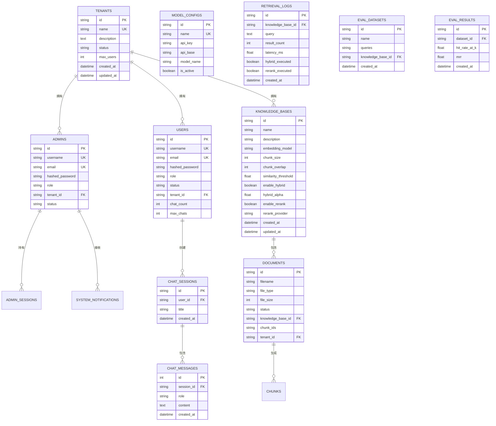

# 数据库设计

## 概述

MGAgent 使用 SQLAlchemy ORM 管理 MySQL 8.0 数据库，所有表结构通过 `Base.metadata.create_all()` 自动创建。向量数据存储在 Milvus 2.4 中。

## 数据模型关系图



## 核心数据表

### tenants - 租户表

存储多租户信息，支持多租户隔离。

| 字段 | 类型 | 说明 |
|------|------|------|
| id | VARCHAR(36) | 主键，UUID |
| name | VARCHAR(255) | 租户名称，唯一索引 |
| description | TEXT | 租户描述 |
| status | VARCHAR(50) | 状态：active/inactive |
| max_users | INT | 最大用户数，默认 100 |
| created_at | DATETIME | 创建时间 |
| updated_at | DATETIME | 更新时间 |

### admins - 管理员表

存储管理员账号信息，支持分级权限。

| 字段 | 类型 | 说明 |
|------|------|------|
| id | VARCHAR(36) | 主键，UUID |
| username | VARCHAR(255) | 用户名，唯一 |
| email | VARCHAR(255) | 邮箱，唯一 |
| hashed_password | VARCHAR(255) | bcrypt 加密密码 |
| role | VARCHAR(50) | 角色：platform_admin / tenant_admin |
| tenant_id | VARCHAR(36) | 所属租户（可空） |
| status | VARCHAR(50) | 状态：active/inactive |

### users - 用户表

存储终端用户信息，支持注册审批流程。

| 字段 | 类型 | 说明 |
|------|------|------|
| id | VARCHAR(36) | 主键，UUID |
| username | VARCHAR(255) | 用户名，唯一 |
| email | VARCHAR(255) | 邮箱 |
| hashed_password | VARCHAR(255) | 加密密码 |
| role | VARCHAR(50) | 角色：user |
| status | VARCHAR(50) | 状态：pending/active/rejected |
| tenant_id | VARCHAR(36) | 所属租户 |
| chat_count | INT | 已用对话次数 |
| max_chats | INT | 最大对话次数 |

### knowledge_bases - 知识库表

独立知识库配置，每个知识库可独立设置分块、检索、Rerank 参数。

| 字段 | 类型 | 说明 |
|------|------|------|
| id | VARCHAR(36) | 主键，UUID |
| name | VARCHAR(255) | 知识库名称 |
| description | TEXT | 描述 |
| embedding_model | VARCHAR(100) | Embedding 模型名称 |
| chunk_size | INT | 分块大小，默认 500 |
| chunk_overlap | INT | 分块重叠，默认 50 |
| chunk_separator | VARCHAR(100) | 分块分隔符 |
| retrieve_limit | INT | 检索返回数量，默认 5 |
| similarity_threshold | FLOAT | 相似度阈值，默认 0.3 |
| enable_hybrid | BOOLEAN | 是否启用 Hybrid 混合检索 |
| hybrid_alpha | FLOAT | RRF 权重（0~1），默认 0.5 |
| enable_rerank | BOOLEAN | 是否启用 Rerank 重排 |
| rerank_provider | VARCHAR(50) | Rerank 提供商 |
| rerank_model | VARCHAR(100) | Rerank 模型名称 |
| rerank_top_n | INT | Rerank 后保留数量 |
| rerank_score_threshold | FLOAT | Rerank 分数阈值 |
| vector_db_type | VARCHAR(50) | 向量库类型，默认 milvus |
| tenant_id | VARCHAR(36) | 所属租户 |
| created_at | DATETIME | 创建时间 |
| updated_at | DATETIME | 更新时间 |

### documents - 文档表

存储上传的企业文档信息，关联所属知识库。

| 字段 | 类型 | 说明 |
|------|------|------|
| id | VARCHAR(36) | 主键，UUID |
| filename | VARCHAR(255) | 文件名 |
| file_type | VARCHAR(50) | 文件类型 |
| file_size | INT | 文件大小（字节） |
| status | VARCHAR(50) | 状态：uploaded/processing/completed/failed |
| knowledge_base_id | VARCHAR(36) | 所属知识库外键 |
| chunk_ids | TEXT | 已索引的 chunk ID 列表，用于增量更新时清理 |
| tenant_id | VARCHAR(36) | 所属租户 |
| created_at | DATETIME | 创建时间 |
| updated_at | DATETIME | 更新时间 |

### chat_sessions / chat_messages - 聊天会话与消息

| 表 | 关键字段 |
|----|---------|
| chat_sessions | id, user_id(FK), title, created_at, updated_at |
| chat_messages | id, session_id(FK), role, content, created_at |

### model_configs - 模型配置表

存储 LLM / Embedding / Rerank 模型配置，Admin 端动态管理。

| 字段 | 类型 | 说明 |
|------|------|------|
| id | VARCHAR(36) | 主键 |
| name | VARCHAR(255) | 配置名称，唯一 |
| type | VARCHAR(50) | 类型：llm / embedding / rerank |
| api_key | VARCHAR(500) | API 密钥 |
| api_base | VARCHAR(200) | API 基础 URL |
| model_name | VARCHAR(100) | 模型名称 |
| is_active | BOOLEAN | 是否为当前活跃配置 |
| config_json | TEXT | 额外配置（JSON） |
| created_at | DATETIME | 创建时间 |
| updated_at | DATETIME | 更新时间 |

### retrieval_logs - 检索日志表

记录每次 RAG 检索的详细信息，用于调试和评估。

| 字段 | 类型 | 说明 |
|------|------|------|
| id | VARCHAR(36) | 主键 |
| knowledge_base_id | VARCHAR(36) | 知识库外键 |
| query | TEXT | 用户查询 |
| result_count | INT | 召回结果数 |
| latency_ms | FLOAT | 耗时（毫秒） |
| hybrid_executed | BOOLEAN | 是否执行了 Hybrid 检索 |
| rerank_executed | BOOLEAN | 是否执行了 Rerank |
| top_scores | TEXT | 召回分数（JSON） |
| error | TEXT | 错误信息（如有） |
| created_at | DATETIME | 创建时间 |

### eval_datasets / eval_results - 离线评估

| 表 | 关键字段 |
|----|---------|
| eval_datasets | id, name, knowledge_base_id(FK), queries(JSON), created_at |
| eval_results | id, dataset_id(FK), hit_rate_at_k, mrr, metrics_json, created_at |

## 向量数据库设计

### Milvus 集合 Schema

```python
from pymilvus import CollectionSchema, FieldSchema, DataType

fields = [
    FieldSchema(name="id", dtype=DataType.VARCHAR, is_primary=True, max_length=64),
    FieldSchema(name="knowledge_base_id", dtype=DataType.VARCHAR, max_length=64),
    FieldSchema(name="content", dtype=DataType.VARCHAR, max_length=65535),
    FieldSchema(name="metadata", dtype=DataType.JSON),
    FieldSchema(name="embedding", dtype=DataType.FLOAT_VECTOR, dim=1536),
]

schema = CollectionSchema(fields, description="MGAgent Knowledge Chunks")

# 索引配置
index_params = {
    "metric_type": "L2",
    "index_type": "IVF_FLAT",
    "params": {"nlist": 1024}
}

# 集合名称
collection_name = "mgagent_knowledge"
```

### 知识库隔离

通过 `knowledge_base_id` 字段实现多知识库隔离：

- 写入时：每个 chunk 携带所属 `knowledge_base_id`
- 查询时：通过 `expr='knowledge_base_id == "xxx"'` 过滤
- 删除时：支持按 `knowledge_base_id` 批量删除

## 数据持久化

### Docker 数据卷

```yaml
volumes:
  mysql_data:
    driver: local
  milvus_data:
    driver: local
  etcd_data:
    driver: local
  minio_data:
    driver: local
```

### 数据备份

```bash
# MySQL 备份
docker exec mgagent-mysql mysqldump -u mgagent -p mgagent > backup.sql

# MySQL 恢复
docker exec -i mgagent-mysql mysql -u mgagent -p mgagent < backup.sql

# MinIO 备份
docker run --rm -v minio_data:/data -v $(pwd):/backup \
  alpine tar czf /backup/minio-backup.tar.gz /data

# Milvus 元数据备份
docker run --rm -v etcd_data:/data -v $(pwd):/backup \
  alpine tar czf /backup/etcd-backup.tar.gz /data
```

## 数据库工厂实现

```python
# app/db/database.py
from sqlalchemy import create_engine
from sqlalchemy.orm import sessionmaker
from app.config.config import get_database_url

def _create_mysql_engine():
    return create_engine(
        get_database_url(),
        pool_pre_ping=True,
        pool_recycle=3600,
        pool_size=10,
        max_overflow=20,
        echo=settings.DEBUG,
    )

def init_engine():
    global engine, SessionLocal
    engine = _create_mysql_engine()
    SessionLocal = sessionmaker(autocommit=False, autoflush=False, bind=engine)
    return engine
```

## 相关文档

- [技术栈架构](/architecture/dual-stack)
- [RAG 架构](/architecture/rag)
- [模型配置架构](/architecture/model-config)
- [生产部署](/deployment/production-deployment)
