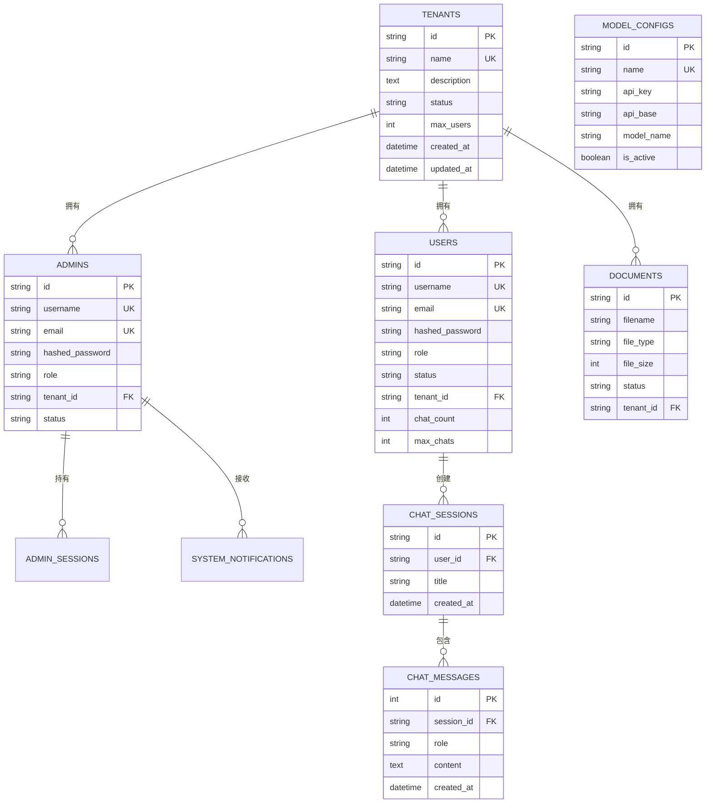

# 数据库设计

## 概述

MGAgent 使用 SQLAlchemy ORM 管理数据库，支持 SQLite 和 MySQL 双引擎。所有表结构通过 `Base.metadata.create_all()` 自动创建。

## 数据模型关系图



## 核心数据表

### tenants - 租户表

存储多租户信息，支持多租户隔离。

| 字段 | 类型 | 说明 |
|------|------|------|
| id | VARCHAR(36) | 主键，UUID |
| name | VARCHAR(255) | 租户名称，唯一索引 |
| description | TEXT | 租户描述 |
| status | VARCHAR(50) | 状态：active/inactive |
| max_users | INT | 最大用户数，默认 100 |
| created_at | DATETIME | 创建时间 |
| updated_at | DATETIME | 更新时间 |

### admins - 管理员表

存储管理员账号信息，支持分级权限。

| 字段 | 类型 | 说明 |
|------|------|------|
| id | VARCHAR(36) | 主键，UUID |
| username | VARCHAR(255) | 用户名，唯一 |
| email | VARCHAR(255) | 邮箱，唯一 |
| hashed_password | VARCHAR(255) | bcrypt 加密密码 |
| role | VARCHAR(50) | 角色：platform_admin / tenant_admin |
| tenant_id | VARCHAR(36) | 所属租户（可空） |
| status | VARCHAR(50) | 状态：active/inactive |

### admin_sessions - 管理员会话表

存储管理员登录会话信息。

| 字段 | 类型 | 说明 |
|------|------|------|
| id | VARCHAR(36) | 主键，UUID |
| admin_id | VARCHAR(36) | 管理员 ID 外键 |
| token | VARCHAR(512) | JWT Token |
| expires_at | DATETIME | 过期时间 |
| created_at | DATETIME | 创建时间 |

### users - 用户表

存储终端用户信息，支持注册审批流程。

| 字段 | 类型 | 说明 |
|------|------|------|
| id | VARCHAR(36) | 主键，UUID |
| username | VARCHAR(255) | 用户名，唯一 |
| email | VARCHAR(255) | 邮箱 |
| hashed_password | VARCHAR(255) | 加密密码 |
| role | VARCHAR(50) | 角色：user |
| status | VARCHAR(50) | 状态：pending/active/rejected |
| tenant_id | VARCHAR(36) | 所属租户 |
| chat_count | INT | 已用对话次数 |
| max_chats | INT | 最大对话次数 |

### chat_sessions - 聊天会话表

存储对话会话信息。

| 字段 | 类型 | 说明 |
|------|------|------|
| id | VARCHAR(36) | 主键，UUID |
| user_id | VARCHAR(36) | 用户 ID 外键 |
| title | VARCHAR(255) | 会话标题 |
| created_at | DATETIME | 创建时间 |
| updated_at | DATETIME | 更新时间 |

### chat_messages - 聊天消息表

存储对话消息内容。

| 字段 | 类型 | 说明 |
|------|------|------|
| id | INT | 自增主键 |
| session_id | VARCHAR(36) | 会话 ID 外键 |
| role | VARCHAR(50) | 角色：user/assistant/system |
| content | TEXT | 消息内容 |
| created_at | DATETIME | 创建时间 |

### model_configs - 模型配置表

存储 LLM 模型配置信息，支持动态切换。

| 字段 | 类型 | 说明 |
|------|------|------|
| id | VARCHAR(36) | 主键，UUID |
| name | VARCHAR(255) | 配置名称，唯一 |
| api_key | VARCHAR(500) | API 密钥 |
| api_base | VARCHAR(200) | API 基础 URL |
| model_name | VARCHAR(100) | 模型名称 |
| is_active | BOOLEAN | 是否为当前活跃配置 |
| created_at | DATETIME | 创建时间 |
| updated_at | DATETIME | 更新时间 |

### documents - 文档表

存储上传的企业文档信息。

| 字段 | 类型 | 说明 |
|------|------|------|
| id | VARCHAR(36) | 主键，UUID |
| filename | VARCHAR(255) | 文件名 |
| file_type | VARCHAR(50) | 文件类型 |
| file_size | INT | 文件大小（字节） |
| status | VARCHAR(50) | 状态：uploaded/processing/completed/failed |
| tenant_id | VARCHAR(36) | 所属租户 |

### system_notifications - 系统通知表

存储系统通知信息。

| 字段 | 类型 | 说明 |
|------|------|------|
| id | VARCHAR(36) | 主键，UUID |
| type | VARCHAR(50) | 通知类型 |
| title | VARCHAR(255) | 通知标题 |
| message | TEXT | 通知内容 |
| is_read | BOOLEAN | 是否已读 |
| created_at | DATETIME | 创建时间 |

### anonymous_stats - 匿名统计表

存储匿名用户使用统计。

| 字段 | 类型 | 说明 |
|------|------|------|
| id | INT | 自增主键 |
| date | DATE | 统计日期 |
| count | INT | 使用次数 |

## 向量数据库设计

### ChromaDB（开发方案）

ChromaDB 以本地文件形式持久化存储：

```python
# 配置路径
CHROMA_PERSIST_DIR: str = "data/chroma"

# 集合名称
collection_name = "mgagent_knowledge"

# 支持的操作
- add_documents(): 添加文档向量
- similarity_search(): 相似度搜索
- get_stats(): 获取统计信息
- clear_all(): 清空所有数据
```

### Milvus（生产方案）

Milvus 集合 Schema 定义：

```python
# 集合字段定义
fields = [
    FieldSchema(name="id", dtype=DataType.VARCHAR, is_primary=True, max_length=64),
    FieldSchema(name="content", dtype=DataType.VARCHAR, max_length=65535),
    FieldSchema(name="metadata", dtype=DataType.JSON),
    FieldSchema(name="embedding", dtype=DataType.FLOAT_VECTOR, dim=1536)
]

# 索引配置
index_params = {
    "metric_type": "L2",
    "index_type": "IVF_FLAT",
    "params": {"nlist": 1024}
}

# 集合名称
collection_name = "mgagent_knowledge"
```

## 数据持久化

### Docker 数据卷

```yaml
# SQLite 方案 - 本地挂载
volumes:
  - ./mgagent-backend/data:/app/data

# MySQL 方案 - 命名卷
volumes:
  mysql_data:
    driver: local
  milvus_data:
    driver: local
  etcd_data:
    driver: local
  minio_data:
    driver: local
```

### 本地开发

```bash
# SQLite 数据路径
mgagent-backend/data/
├── sqlite/
│   └── app.db          # SQLite 数据库文件
├── chroma/             # ChromaDB 向量数据
└── documents/          # 上传的文档
```

## 数据库初始化

### 自动初始化

系统启动时自动通过 SQLAlchemy 创建表结构：

```python
from app.db.database import init_db

# 初始化所有表
init_db()
```

### MySQL 初始化脚本

`docker/mysql/init.sql` 在 MySQL 容器首次启动时执行：

```sql
-- 设置字符集
SET NAMES utf8mb4;
SET CHARACTER SET utf8mb4;
USE mgagent;

-- 创建表结构...
-- 插入默认管理员
INSERT INTO admins (id, username, email, hashed_password, role, status)
VALUES ('admin-001', 'admin', 'admin@mgagent.com', 
        '$2b$12$...', 'platform_admin', 'active')
ON DUPLICATE KEY UPDATE username=username;
```

## 数据库工厂实现

```python
# app/db/database.py
from sqlalchemy import create_engine
from sqlalchemy.orm import sessionmaker
from app.config.config import is_mysql_scheme, is_sqlite_scheme, get_database_url

def init_engine():
    if is_mysql_scheme():
        engine = create_engine(
            get_database_url(),
            pool_pre_ping=True,
            pool_recycle=3600,
            pool_size=10,
            max_overflow=20
        )
    else:
        engine = create_engine(
            get_database_url(),
            connect_args={"check_same_thread": False},
            poolclass=StaticPool
        )

    SessionLocal = sessionmaker(autocommit=False, autoflush=False, bind=engine)
    return engine, SessionLocal
```

## 相关文档

- [双技术栈架构](/architecture/dual-stack)
- [模型配置架构](/architecture/model-config)
- [MySQL 方案部署](/deployment/mysql-deployment)