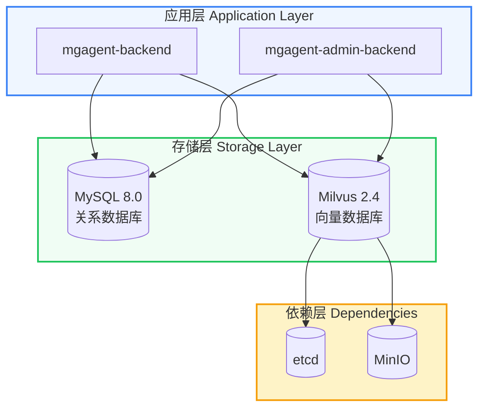

# 技术栈架构

:::info 概述
MGAgent 统一采用 **MySQL + Milvus + MinIO** 技术栈，一套方案覆盖本地开发和生产部署，简化运维和数据迁移。
:::

## 架构图



## 技术选型说明

| 组件 | 版本 | 说明 |
|------|------|------|
| MySQL | 8.0 | 企业级关系数据库，支持高并发、事务、完整 SQL 特性 |
| Milvus | 2.4 | 高性能向量数据库，支持亿级向量检索、IVF_FLAT / HNSW 索引 |
| etcd | v3.5.5 | Milvus 元数据存储（依赖） |
| MinIO | latest | Milvus 对象存储（依赖），同时作为文档存储 |

## 代码层面的统一接口

### 数据库工厂

`app/db/database.py` 直接创建 MySQL 引擎：

```python
from app.config.config import get_database_url

def _create_mysql_engine():
    return create_engine(
        get_database_url(),
        pool_pre_ping=True,
        pool_recycle=3600,
        pool_size=10,
        max_overflow=20,
        echo=settings.DEBUG,
    )

def init_engine():
    global engine, SessionLocal
    engine = _create_mysql_engine()
    SessionLocal = sessionmaker(autocommit=False, autoflush=False, bind=engine)
    return engine
```

### 向量数据库工厂

`app/rag/vector_factory.py` 统一通过工厂创建 Milvus 实例：

```python
class VectorDBInterface(ABC):
    @abstractmethod
    def add_documents(self, documents, embeddings): ...

    @abstractmethod
    def similarity_search(self, query_embedding, k=3, knowledge_base_ids=None, threshold=None): ...

    @abstractmethod
    def get_total_count(self): ...

    @abstractmethod
    def delete_by_ids(self, ids): ...

    @abstractmethod
    def clear_all(self): ...

class MilvusService(VectorDBInterface):
    """Milvus 实现"""

def get_vector_db() -> VectorDBInterface:
    global _vector_db_instance
    if _vector_db_instance is None:
        _vector_db_instance = MilvusService()
    return _vector_db_instance
```

### 配置模块

`app/config/config.py` 集中管理所有连接参数：

```python
class Settings(BaseSettings):
    # MySQL
    MYSQL_HOST: str = "localhost"
    MYSQL_PORT: int = 3306
    MYSQL_USER: str = "mgagent"
    MYSQL_PASSWORD: str = "mgagent_password_2024"
    MYSQL_DATABASE: str = "mgagent"

    # Milvus
    MILVUS_HOST: str = "localhost"
    MILVUS_PORT: int = 19530
    MILVUS_COLLECTION: str = "mgagent_knowledge"

    # MinIO
    MINIO_HOST: str = "localhost"
    MINIO_PORT: int = 9000
    MINIO_ACCESS_KEY: str = "minioadmin"
    MINIO_SECRET_KEY: str = "minioadmin"
    MINIO_BUCKET: str = "mgagent-documents"

def get_database_url() -> str:
    return f"mysql+pymysql://{settings.MYSQL_USER}:{settings.MYSQL_PASSWORD}@{settings.MYSQL_HOST}:{settings.MYSQL_PORT}/{settings.MYSQL_DATABASE}?charset=utf8mb4"
```

## 环境变量配置

所有配置集中在 `.env` 文件中：

```bash
# MySQL
MYSQL_HOST=localhost
MYSQL_PORT=3306
MYSQL_USER=mgagent
MYSQL_PASSWORD=mgagent_password_2024
MYSQL_DATABASE=mgagent

# Milvus
MILVUS_HOST=localhost
MILVUS_PORT=19530
MILVUS_COLLECTION=mgagent_knowledge

# MinIO
MINIO_HOST=localhost
MINIO_PORT=9000
MINIO_ACCESS_KEY=minioadmin
MINIO_SECRET_KEY=minioadmin
MINIO_BUCKET=mgagent-documents
```

## Docker Compose 分层部署

```bash
# 基础设施（MySQL + Milvus + etcd + MinIO + Attu）
docker compose -f docker-compose.infra.yml up -d

# 应用层（Chat 后端 + Admin 后端 + 两个前端）
docker compose -f docker-compose.prod.yml up -d --build
```

或使用一键脚本：

```bash
./scripts/deploy.sh up
```

## 相关文档

- [架构概述](/architecture/overview)
- [数据库设计](/architecture/database)
- [RAG 架构](/architecture/rag)
- [Docker 部署](/deployment/docker-deployment)
- [生产部署](/deployment/production-deployment)
