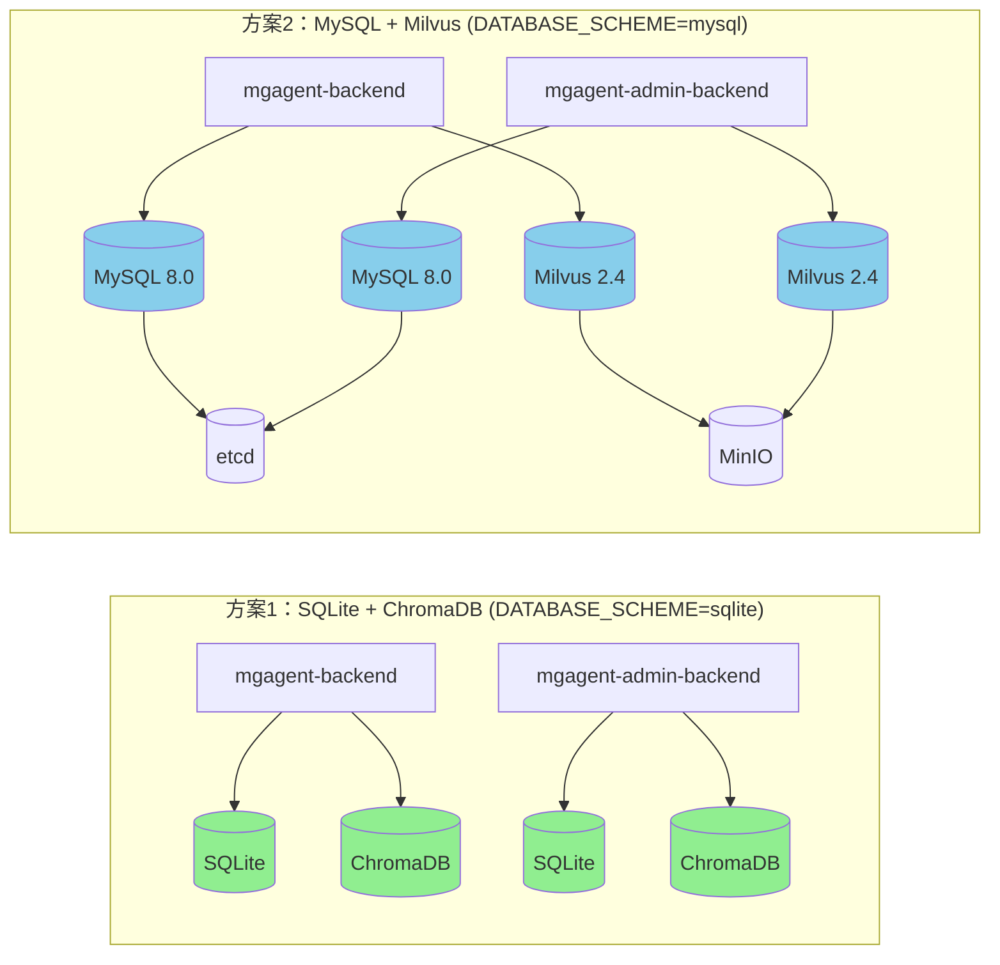

# 双技术栈架构

:::info 概述
MGAgent 独创双技术栈架构，通过统一接口抽象和工厂模式，实现 SQLite+ChromaDB（开发方案）和 MySQL+Milvus（生产方案）的无缝切换。
:::

## 方案对比

| 特性 | SQLite + ChromaDB | MySQL + Milvus |
|------|-------------------|----------------|
| 关系数据库 | SQLite 3.x | MySQL 8.0 |
| 向量数据库 | ChromaDB 0.5+ | Milvus 2.4 |
| 适用场景 | 轻量级单机部署，开发调试 | 高性能生产部署，大规模数据 |
| 部署复杂度 | 简单（无需外部依赖） | 中等（依赖 MySQL、Milvus 等） |
| 性能 | 单机性能，适合小规模数据 | 高并发，支持大数据量 |
| Compose 文件 | `docker-compose.local.yml` | `docker-compose.infra.yml` + `docker-compose.mysql-app.yml` |
| 环境变量 | `DATABASE_SCHEME=sqlite` | `DATABASE_SCHEME=mysql` |

## 架构示意图



## 切换机制

### 1. 环境变量配置

通过设置 `DATABASE_SCHEME` 环境变量来选择技术栈：

```bash
# 方案1：SQLite + ChromaDB（默认）
export DATABASE_SCHEME=sqlite

# 方案2：MySQL + Milvus
export DATABASE_SCHEME=mysql
```

### 2. 代码层面切换

系统通过工厂模式实现动态切换：

#### 数据库工厂

`app/db/database.py` 根据 `DATABASE_SCHEME` 创建对应的数据库引擎：

```python
from app.config.config import is_mysql_scheme, is_sqlite_scheme

def init_engine():
    if is_mysql_scheme():
        engine = _create_mysql_engine()
    else:
        engine = _create_sqlite_engine()
    SessionLocal = sessionmaker(autocommit=False, autoflush=False, bind=engine)
    return engine
```

#### 向量数据库工厂

`app/rag/vector_factory.py` 定义统一的抽象接口：

```python
from abc import ABC, abstractmethod

class VectorDBInterface(ABC):
    @abstractmethod
    def add_documents(self, documents, embeddings): ...

    @abstractmethod
    def similarity_search(self, query_embedding, k=3): ...

    @abstractmethod
    def get_stats(self): ...

    @abstractmethod
    def clear_all(self): ...

class ChromaDBService(VectorDBInterface):
    """ChromaDB 实现"""

class MilvusService(VectorDBInterface):
    """Milvus 实现"""

def create_vector_db():
    if is_mysql_scheme():
        return MilvusService()
    return ChromaDBService()
```

#### 配置模块

`app/config/config.py` 集中管理两套方案的所有配置：

```python
class DatabaseScheme(str, Enum):
    SQLITE = "sqlite"
    MYSQL = "mysql"

class Settings(BaseSettings):
    DATABASE_SCHEME: str = os.getenv("DATABASE_SCHEME", "sqlite")

    # SQLite 配置
    SQLITE_DB_PATH: str = "data/chat.db"
    CHROMA_PERSIST_DIR: str = "data/chroma"

    # MySQL 配置
    MYSQL_HOST: str = "localhost"
    MYSQL_PORT: int = 3306
    MYSQL_USER: str = "mgagent"
    MYSQL_PASSWORD: str = "mgagent_password_2024"
    MYSQL_DATABASE: str = "mgagent"

    # Milvus 配置
    MILVUS_HOST: str = "localhost"
    MILVUS_PORT: int = 19530
    MILVUS_COLLECTION: str = "mgagent_knowledge"
```

### 3. Docker Compose 切换

```bash
# SQLite 方案（单一 Compose 文件）
docker compose -f docker-compose.local.yml up -d

# MySQL 方案（分层部署）
# 第一步：启动基础设施
docker compose -f docker-compose.infra.yml up -d
# 第二步：启动应用层
docker compose -f docker-compose.mysql-app.yml up -d
```

## 技术栈详细对比

### SQLite + ChromaDB

| 组件 | 版本 | 说明 |
|------|------|------|
| SQLite | 3.x | 轻量级嵌入式数据库，零配置 |
| ChromaDB | 0.5+ | 嵌入式向量数据库，本地持久化 |
| 数据存储 | 本地文件 | 无需外部服务 |

**优势：**
- 部署简单，无需外部依赖
- 单机性能满足开发需求
- 零运维成本

**劣势：**
- 不支持高并发
- 数据量受限于单机
- 不适合生产环境

### MySQL + Milvus

| 组件 | 版本 | 说明 |
|------|------|------|
| MySQL | 8.0 | 企业级关系数据库 |
| Milvus | 2.4 | 高性能向量数据库 |
| etcd | v3.5.5 | Milvus 元数据存储 |
| MinIO | latest | Milvus 对象存储 |

**优势：**
- 支持高并发和大规模数据
- 企业级可靠性
- 丰富的管理工具（Attu）

**劣势：**
- 部署复杂度较高
- 需要维护多个服务
- 资源占用更大

## 选择建议

:::tip 如何选择
- **个人开发者 / 小型团队**：使用 SQLite + ChromaDB，快速启动、易于调试
- **企业生产环境**：使用 MySQL + Milvus，保证性能和可靠性
- **从开发到生产**：开发阶段使用 SQLite，部署时切换到 MySQL，代码零修改
:::

## 相关文档

- [架构概述](/architecture/overview)
- [数据库设计](/architecture/database)
- [Docker 部署](/deployment/docker-deployment)
- [MySQL 方案部署](/deployment/mysql-deployment)