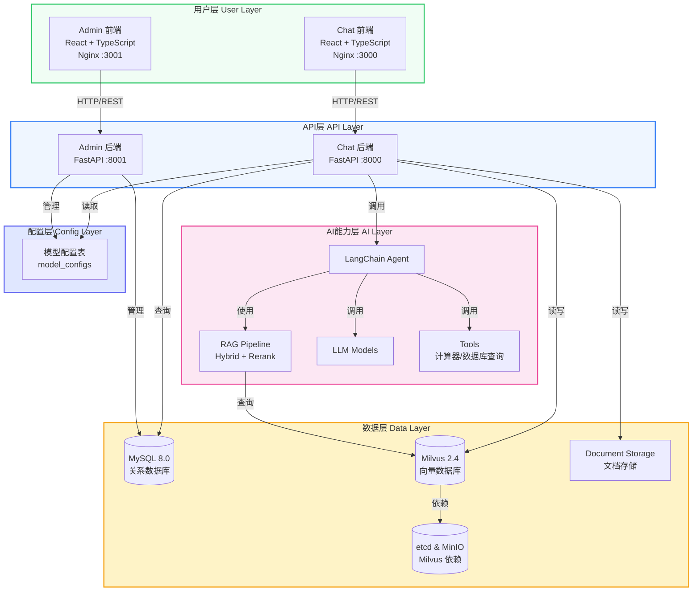
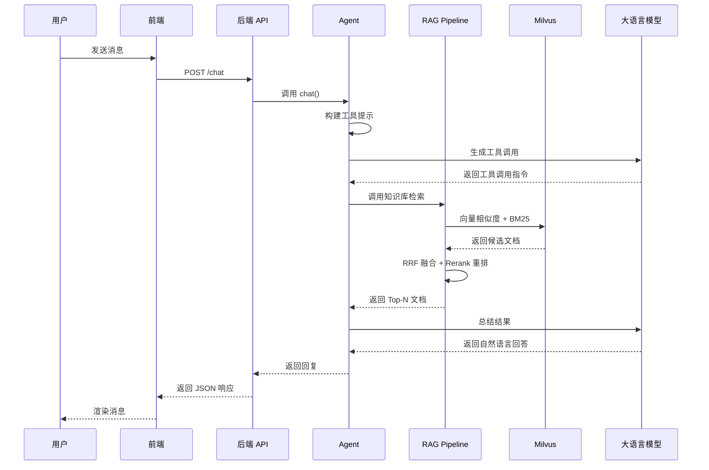
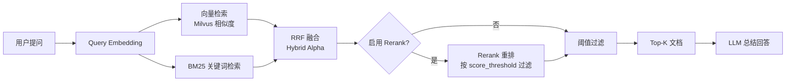

# 架构概述

## 设计原则

MGAgent 的架构设计遵循以下核心原则：

1. **生产级技术栈**：统一使用 MySQL + Milvus + MinIO，一套方案覆盖开发和生产
2. **前后端分离**：前端和后端完全独立，便于团队协作
3. **统一接口抽象**：通过工厂模式实现数据库和向量数据库的统一接口
4. **配置集中管理**：所有技术选型、连接参数集中在 `config.py` 和 `.env`
5. **模块化设计**：API 按功能模块拆分（auth、users、model、knowledge 等）
6. **插件化工具**：Agent 工具采用插件化设计，易于扩展
7. **动态模型配置**：所有 LLM 配置从数据库读取，无需静态配置
8. **容器化部署**：支持 Docker Compose 一键部署，分层管理基础设施和应用层

## 系统架构图

## 模块划分

### 后端模块

| 模块 | 路径 | 说明 |
|------|------|------|
| API 路由 | `app/api/` | RESTful API 接口定义 |
| Agent 核心 | `app/agent/` | LangChain Agent 逻辑 |
| 配置模块 | `app/config/` | 统一配置，集中管理 MySQL / Milvus / MinIO |
| 数据库 | `app/db/` | SQLAlchemy ORM 模型与 MySQL 工厂 |
| RAG 模块 | `app/rag/` | 检索增强生成，含向量库工厂、Hybrid/Rerank 流水线 |
| 服务层 | `app/services/` | 业务逻辑（模型配置管理） |
| 工具集 | `app/tools/` | Agent 可用工具（计算器、SQL 查询） |

### 前端模块

| 模块 | 路径 | 说明 |
|------|------|------|
| Chat 前端 | `mgagent-frontend/` | 用户对话界面 |
| Admin 前端 | `mgagent-admin-frontend/` | 管理后台界面 |

### 服务端口

| 服务 | 开发端口 | 生产端口 |
|------|---------|---------|
| Chat 后端 API | 8000 | 8000 |
| Admin 后端 API | 8001 | 8001 |
| Chat 前端 | 5173 | 3000 |
| Admin 前端 | 5174 | 3001 |

## 核心数据流

### 请求处理流程

### RAG 流水线

## 技术选型

### 后端

| 技术 | 版本 | 用途 |
|------|------|------|
| FastAPI | >= 0.100 | 高性能异步 API 框架 |
| LangChain | >= 0.2 | LLM 应用开发框架 |
| SQLAlchemy | >= 2.0 | ORM 数据库操作 |
| PyJWT | >= 2.8 | JWT 身份认证 |
| bcrypt | >= 4.0 | 密码加密 |
| PyMilvus | >= 2.4 | Milvus 向量数据库客户端 |

### 前端

| 技术 | 版本 | 用途 |
|------|------|------|
| React | 18 | UI 框架 |
| TypeScript | 5 | 类型安全 |
| Tailwind CSS | 3 | 样式框架 |
| Vite | 5 | 构建工具 |
| Axios | 1.6 | HTTP 客户端 |

### 基础设施

| 技术 | 用途 |
|------|------|
| Docker | 容器化部署 |
| Docker Compose | 服务编排 |
| Nginx | 前端部署与 API 代理 |
| MySQL 8.0 | 关系数据库 |
| Milvus 2.4 | 向量数据库 |
| MinIO | 对象存储 |
| etcd | Milvus 元数据存储 |

## 相关文档

- [数据库设计](/architecture/database)
- [RAG 架构](/architecture/rag)
- [模型配置架构](/architecture/model-config)
