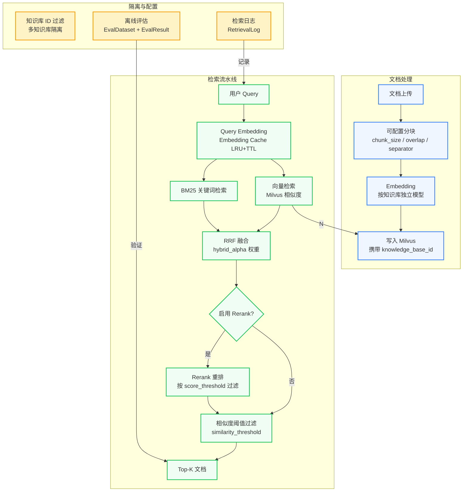

# RAG 架构

:::info 概述
MGAgent 实现了一套完整的企业级 RAG（Retrieval Augmented Generation）流水线，支持多知识库隔离、可配置分块、Hybrid 混合检索、Rerank 重排、检索日志和离线评估。
:::

## 整体架构



## 1. 多知识库隔离

每个知识库是独立的配置单元，完全隔离：

| 配置项 | 说明 | 示例 |
|--------|------|------|
| `name` | 知识库名称 | "产品文档" |
| `embedding_model` | Embedding 模型 | bge-small-zh-v1.5 |
| `chunk_size` | 分块大小 | 500 |
| `chunk_overlap` | 分块重叠 | 50 |
| `chunk_separator` | 分块分隔符 | `\n` |
| `retrieve_limit` | 检索返回数量 | 5 |
| `similarity_threshold` | 相似度阈值 | 0.3 |
| `enable_hybrid` | 是否启用 Hybrid | true |
| `hybrid_alpha` | RRF 融合权重 | 0.5 |
| `enable_rerank` | 是否启用 Rerank | true |
| `rerank_provider` | Rerank 提供商 | siliconflow / cohere / jina |
| `rerank_top_n` | Rerank 后保留数量 | 3 |
| `rerank_score_threshold` | Rerank 分数阈值 | 0.5 |

**Milvus 隔离实现**：所有 chunk 携带 `knowledge_base_id` 字段，查询时通过表达式过滤：

```python
expr = f'knowledge_base_id == "{knowledge_base_id}"'
results = collection.search(
    data=[query_embedding],
    anns_field="embedding",
    param=search_params,
    limit=top_k,
    expr=expr,
    output_fields=["content", "metadata"],
)
```

## 2. 可配置分块

分块策略按知识库独立设置：

```python
from langchain.text_splitter import RecursiveCharacterTextSplitter

splitter = RecursiveCharacterTextSplitter(
    chunk_size=kb.chunk_size,          # 默认 500
    chunk_overlap=kb.chunk_overlap,    # 默认 50
    separators=kb.chunk_separator,     # 默认 ["\n\n", "\n", " ", ""]
)

chunks = splitter.split_text(text)
```

### 支持的 Loader

| Loader | 文件类型 | 元数据提取 |
|--------|---------|-----------|
| PyPDFLoader | PDF | page_number |
| Docx2txtLoader | Word (.docx) | - |
| TextLoader | TXT | - |
| UnstructuredMarkdownLoader | Markdown (.md) | section |
| ExcelLoader | Excel (.xlsx) | sheet_name, row_count |
| CSVLoader | CSV | row_count |
| JSONLoader | JSON | key_count |
| CodeLoader | Python / JS / Java / Go 等 | language, function |

### 语义分块

Markdown 文档支持按标题分块：

```python
# 按 heading 分块，保留层级结构
splitter = MarkdownHeadingSplitter(
    heading_levels=[1, 2, 3],
    chunk_size=kb.chunk_size,
)
```

## 3. Hybrid 混合检索

### BM25 关键词检索

实现了基于 BM25 的关键词检索，替代原始的子串匹配：

```python
from rank_bm25 import BM25Okapi

# 初始化 BM25
bm25 = BM25Okapi(corpus_tokens)

# 中文 bigram + 英文 token 提取
keywords = _extract_keywords(query)
bm25_scores = bm25.get_scores(query_tokens)
```

### RRF 融合

Reciprocal Rank Fusion 合并向量和关键词的召回结果：

```python
def reciprocal_rank_fusion(
    vector_results: list,
    bm25_results: list,
    alpha: float = 0.5,
    k: int = 60,
) -> list:
    """
    alpha 控制融合权重：
    - alpha = 0  → 仅 BM25
    - alpha = 1  → 仅向量
    - alpha = 0.5 → 均衡融合（默认）
    """
    fused = {}
    for rank, doc_id in enumerate(vector_results, start=1):
        fused[doc_id] = fused.get(doc_id, 0) + alpha / (k + rank)
    for rank, doc_id in enumerate(bm25_results, start=1):
        fused[doc_id] = fused.get(doc_id, 0) + (1 - alpha) / (k + rank)
    return sorted(fused.items(), key=lambda x: x[1], reverse=True)
```

## 4. Rerank 重排

支持多个 Rerank 提供商的统一接口：

```python
class RerankerInterface(ABC):
    @abstractmethod
    def rerank(self, query: str, documents: list, top_n: int, score_threshold: float) -> list: ...

class SiliconFlowReranker(RerankerInterface): ...
class CohereReranker(RerankerInterface): ...
class JinaReranker(RerankerInterface): ...
class OpenAICompatibleReranker(RerankerInterface): ...
```

**按知识库配置启用**：

```python
if kb.enable_rerank:
    reranker = RerankerFactory.create(kb.rerank_provider, kb.rerank_model)
    results = reranker.rerank(
        query=query,
        documents=hybrid_results,
        top_n=kb.rerank_top_n,
        score_threshold=kb.rerank_score_threshold,
    )
```

## 5. Embedding 缓存

LRU + TTL 缓存，避免重复调用 Embedding API：

```python
class EmbeddingCache:
    def __init__(self, max_size: int = 1024, ttl_seconds: int = 3600):
        self._cache = OrderedDict()
        self._max_size = max_size
        self._ttl = ttl_seconds

    def get(self, query: str) -> Optional[list]:
        if query in self._cache:
            value, timestamp = self._cache[query]
            if time.time() - timestamp < self._ttl:
                self._cache.move_to_end(query)
                return value
            del self._cache[query]
        return None

    def put(self, query: str, embedding: list):
        if len(self._cache) >= self._max_size:
            self._cache.popitem(last=False)
        self._cache[query] = (embedding, time.time())
```

## 6. 检索调试与日志

### Retrieve-Test API

Admin 端提供实时检索测试面板：

```bash
POST /admin/api/knowledge/retrieve-test
Content-Type: application/json

{
    "knowledge_base_id": "xxx",
    "query": "如何配置 Embedding 模型？"
}
```

**响应包含**：

```json
{
    "chunks": [...],
    "threshold": 0.3,
    "before_threshold": 12,
    "after_threshold": 5,
    "hybrid_executed": true,
    "rerank_executed": true,
    "timing": {
        "embedding_ms": 12.3,
        "vector_search_ms": 45.6,
        "bm25_ms": 8.9,
        "rrf_ms": 1.2,
        "rerank_ms": 23.4,
        "total_ms": 91.4
    },
    "note": "Hybrid: 向量 + BM25 RRF 融合, Rerank: SiliconFlow reranker"
}
```

### RetrievalLog

每次检索自动记录到 MySQL 的 `retrieval_logs` 表：

| 字段 | 说明 |
|------|------|
| query | 用户查询 |
| result_count | 召回数量 |
| latency_ms | 总耗时 |
| hybrid_executed | 是否执行了 Hybrid |
| rerank_executed | 是否执行了 Rerank |
| top_scores | 召回分数（JSON） |
| error | 错误信息 |

## 7. 离线评估

### EvalDataset

管理员可以创建评估数据集：

```bash
POST /admin/api/knowledge/eval/datasets
{
    "name": "产品文档评估集",
    "knowledge_base_id": "xxx",
    "queries": [
        {"query": "如何配置模型连接？", "expected_chunk_ids": ["id1", "id2"]},
        {"query": "支持哪些文件格式？", "expected_chunk_ids": ["id3"]},
        ...
    ]
}
```

### 运行评估

```bash
POST /admin/api/knowledge/eval/datasets/{dataset_id}/run
```

### 评估指标

| 指标 | 公式 | 说明 |
|------|------|------|
| **HitRate@k** | hits / total_queries | Top-k 中命中期望文档的查询比例 |
| **MRR** | Σ 1/rank / total_queries | 第一个期望文档排名倒数的平均值 |

## 8. 增量更新

文档重新上传时自动清理旧的向量数据：

```python
# documents 表存储 chunk_ids
doc.chunk_ids = ",".join([chunk.id for chunk in chunks])

# 重索引时先删除旧 chunk
old_ids = doc.chunk_ids.split(",") if doc.chunk_ids else []
if old_ids:
    vector_db.delete_by_ids(old_ids)

# 再写入新 chunk
vector_db.add_documents(new_chunks, new_embeddings)
```

## 相关文档

- [架构概述](/architecture/overview)
- [数据库设计](/architecture/database)
- [技术栈架构](/architecture/dual-stack)
- [模型配置架构](/architecture/model-config)
