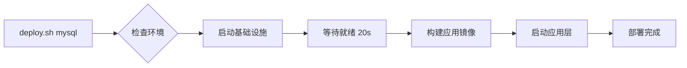

# 脚本使用指南

## 概述

MGAgent 在 `scripts/` 目录下提供了一系列工具脚本，用于简化部署、开发和运维流程。

## 脚本列表

| 脚本 | 用途 | 适用场景 |
|------|------|---------|
| `init.sh` | 一键初始化项目 | 首次安装 |
| `start-all.sh` | 启动本地开发服务 | 本地开发 |
| `stop-all.sh` | 停止本地开发服务 | 本地开发 |
| `status.sh` | 检查服务状态 | 运维监控 |
| `deploy.sh` | 一键生产部署 | 生产环境部署 |
| `docker-services.sh` | 基础设施服务管理 | MySQL 方案 |

## init.sh - 项目初始化

首次安装时使用，自动完成所有依赖安装和目录创建。

### 使用方法

```bash
# 添加执行权限
chmod +x scripts/init.sh

# 运行初始化
./scripts/init.sh
```

### 执行内容

1. 安装 `mgagent-backend` Python 依赖
2. 安装 `mgagent-admin-backend` Python 依赖
3. 安装 `mgagent-frontend` Node.js 依赖
4. 安装 `mgagent-admin-frontend` Node.js 依赖
5. 创建必要的数据目录
6. 设置脚本执行权限

### 输出示例

```
=========================================
  MGAgent 初始化脚本
=========================================

[1/4] 安装 mgagent-backend 依赖
-----------------------------------------
正在安装 Python 依赖...
Python 依赖安装完成

[2/4] 安装 mgagent-admin-backend 依赖
...

=========================================
  初始化完成!
=========================================

使用说明:
  启动所有服务: ./scripts/start-all.sh
  停止所有服务: ./scripts/stop-all.sh
  检查服务状态: ./scripts/status.sh
```

## start-all.sh - 启动本地服务

一键启动所有本地开发服务（4 个进程）。

### 使用方法

```bash
chmod +x scripts/start-all.sh
./scripts/start-all.sh
```

### 启动的服务

| 服务 | 端口 | 日志文件 |
|------|------|---------|
| mgagent-backend | 8000 | `mgagent-backend/backend.log` |
| mgagent-admin-backend | 8001 | `mgagent-admin-backend/admin-backend.log` |
| mgagent-frontend | 5173 | `mgagent-frontend/frontend.log` |
| mgagent-admin-frontend | 5174 | `mgagent-admin-frontend/admin-frontend.log` |

### 特点

- 自动停止已运行的服务
- 使用 `nohup` 后台运行
- 记录 PID 到 `.pids/` 目录
- 启动后验证端口监听状态
- 显示访问地址

### 输出示例

```
=========================================
  MGAgent 一键启动脚本
=========================================

[0/4] 停止已运行的服务...
完成

[1/4] 启动 mgagent-backend (端口: 8000)
后端服务已启动 (PIDs: 12345)
日志文件: .../mgagent-backend/backend.log

...

=========================================
  所有服务启动完成!
=========================================

服务地址:
  - 核心前端: http://localhost:5173
  - 核心后端: http://localhost:8000
  - 管理台前端: http://localhost:5174
  - 管理台后端: http://localhost:8001
```

## stop-all.sh - 停止本地服务

安全停止所有本地开发服务，支持优雅关闭和强制终止。

### 使用方法

```bash
./scripts/stop-all.sh
```

### 停止策略

脚本采用三步停止策略：

1. **优雅停止**：发送 SIGTERM 信号，等待 3 秒
2. **强制终止**：检查残留进程，发送 SIGKILL
3. **清理验证**：最终验证所有端口已释放

### 进程查找方式

脚本通过多种方式查找需要终止的进程：

- 从 PID 文件读取
- 通过端口号查找
- 通过命令名查找（vite / uvicorn）

### 输出示例

```
[1/4] 停止 mgagent-backend
  从PID文件找到进程: 12345
  [步骤1] 优雅停止进程组: 12345
  ✓ mgagent-backend 已停止

...

验证服务状态:
  ✓ 端口 8000 已释放
  ✓ 端口 8001 已释放
  ✓ 端口 5173 已释放
  ✓ 端口 5174 已释放
所有端口已成功释放!
```

## status.sh - 服务状态检查

实时检查所有服务的运行状态和健康情况。

### 使用方法

```bash
./scripts/status.sh
```

### 检查内容

- 进程状态：端口监听、PID 文件有效性
- HTTP 访问：测试 API 健康检查端点
- 磁盘使用：显示项目所在磁盘空间

### 输出示例

```
--- 进程状态 ---

mgagent-backend:
  ✓ 端口 8000 正在监听
  进程PID: 12345
    - PID 12345: python3 -m uvicorn app.main:app

mgagent-admin-backend:
  ✓ 端口 8001 正在监听
  ...

--- 服务访问测试 ---

mgagent-backend:
  ✓ 可访问 (HTTP: 200)
  URL: http://localhost:8000/api/health

--- 磁盘使用情况 ---
/dev/disk1s1    500Gi   200Gi  300Gi    40%    /Users/xmg/...
```

## deploy.sh - 生产部署

一键 Docker 生产部署脚本，支持 SQLite 和 MySQL 两种数据库方案，自动完成环境检查、镜像构建和服务启动。

### 使用方法

```bash
# 交互式选择
./scripts/deploy.sh

# SQLite 方案
./scripts/deploy.sh sqlite

# MySQL 方案
./scripts/deploy.sh mysql

# 停止所有服务
./scripts/deploy.sh stop

# 查看状态
./scripts/deploy.sh status

# 查看日志
./scripts/deploy.sh logs

# 清理所有数据
./scripts/deploy.sh cleanup
```

### MySQL 方案部署流程



### 特点

- 彩色输出，清晰易懂
- 支持交互式选择方案
- MySQL 方案自动分层部署（基础设施 + 应用层）
- 自动创建默认配置文件（`.env.sqlite` / `.env.mysql`）
- 健康检查验证
- 支持 SQLite 和 MySQL 双方案一键切换

### 输出示例

```
╔══════════════════════════════════════════════════════════════╗
║                    MGAgent 一键部署脚本                      ║
╚══════════════════════════════════════════════════════════════╝

[INFO] Docker 环境检查通过
[INFO] 正在启动 MySQL + Milvus 方案...
[INFO] 第一步：启动 MySQL + Milvus 基础设施...
[INFO] 等待基础设施就绪 (约 20 秒)...
[INFO] 第二步：构建并启动应用层服务...

╔══════════════════════════════════════════════════════════════╗
║                    🎉 部署成功！                              ║
╚══════════════════════════════════════════════════════════════╝

  方案类型: MySQL + Milvus
  MGAgent 前端:    http://localhost:3000
  管理台前端:      http://localhost:3001
  后端 API:        http://localhost:8000
  管理台 API:      http://localhost:8001

  默认管理员账号: admin / admin123
```

## docker-services.sh - 基础设施管理

专门管理 MySQL + Milvus 基础设施服务的脚本。

### 使用方法

```bash
# 启动基础设施
./scripts/docker-services.sh start

# 停止基础设施
./scripts/docker-services.sh stop

# 重启基础设施
./scripts/docker-services.sh restart

# 查看状态
./scripts/docker-services.sh status

# 查看日志
./scripts/docker-services.sh logs

# 预热所有镜像
./scripts/docker-services.sh preload

# 配置国内镜像源
./scripts/docker-services.sh setup-mirror

# 检查镜像源配置
./scripts/docker-services.sh check-mirror
```

### 管理的服务

| 服务 | 说明 |
|------|------|
| MySQL | 关系数据库 |
| Milvus | 向量数据库 |
| etcd | Milvus 元数据存储 |
| MinIO | Milvus 对象存储 |
| Attu | Milvus 管理界面 |

### 镜像预热

`preload` 命令会预热所有必要的 Docker 镜像：

```bash
./scripts/docker-services.sh preload

# 预热 MySQL + Milvus 相关镜像:
#   mysql:8.0
#   milvusdb/milvus:v2.4.12
#   quay.io/coreos/etcd:v3.5.5
#   minio/minio:RELEASE.2023-03-20T20-16-18Z
#   zilliz/attu:v2.4
```

## 快速参考卡片

```bash
# 首次使用
./scripts/init.sh

# 本地开发（SQLite 方案）
./scripts/start-all.sh       # 启动
./scripts/status.sh          # 检查
./scripts/stop-all.sh        # 停止

# 生产部署（SQLite 方案）
./scripts/deploy.sh sqlite

# 生产部署（MySQL 方案）
./scripts/docker-services.sh start    # 先启动基础设施
./scripts/deploy.sh mysql             # 再启动应用

# 运维
./scripts/deploy.sh status            # 查看状态
./scripts/deploy.sh logs              # 查看日志
./scripts/deploy.sh stop              # 停止所有
```

## 注意事项

:::warning 脚本权限
首次使用脚本前，需要添加执行权限：
```bash
chmod +x scripts/*.sh
```
:::

:::tip 路径自适配
所有脚本内部路径已实现自适配，无论在哪个目录执行都能正确定位项目根目录。
:::

:::warning macOS 兼容性
`docker-services.sh` 已兼容 macOS 环境下 `timeout` 命令不可用的问题，使用 `perl` 作为替代方案。
:::

## 相关文档

- [本地开发部署](/deployment/local-development)
- [Docker 部署](/deployment/docker-deployment)
- [MySQL 方案部署](/deployment/mysql-deployment)