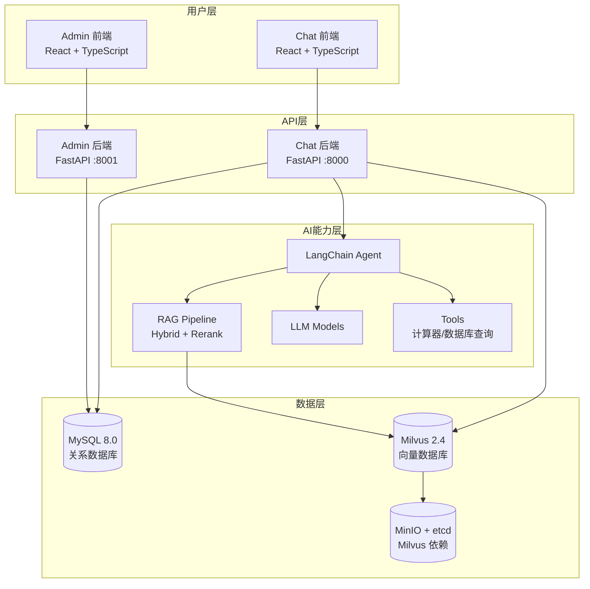

# MGAgent - 企业级智能体系统

:::info 项目概述
**MGAgent** 是一款面向企业场景的智能体系统，基于 [LangChain](https://www.langchain.com/) 框架构建，具备知识库检索增强 (RAG)、多租户管理、自然语言数据库查询和灵活的模型配置能力。
:::

## 核心特性

### 🎯 智能对话
- 基于大语言模型的自然语言交互
- 支持流式响应，提升对话体验
- 多轮上下文理解，精准把握用户意图

### 📚 企业级知识库 (RAG)
- **多知识库隔离**：每个知识库独立管理，支持独立的分块配置、Embedding 模型和检索策略
- **可配置分块**：chunk_size / chunk_overlap / chunk_separator 按知识库灵活设置
- **Hybrid 混合检索**：向量 + BM25 关键词 RRF 融合，兼顾语义与关键词召回
- **Rerank 重排**：支持 SiliconFlow / Cohere / Jina 等多提供商，可按知识库启用
- **扩展 Loader**：支持 PDF / Word / TXT / Markdown / Excel / CSV / JSON / 代码文件
- **检索调试**：内置 retrieve-test 面板，可实时查看阈值过滤、Hybrid/Rerank 执行标志、耗时分解
- **检索日志**：完整记录每次检索的 query、召回结果、耗时，支持分页查询
- **离线评估**：EvalDataset + EvalResult，HitRate@k / MRR 指标

### 🗄️ 数据库查询
- Agent 自动生成 SQL 查询语句
- 支持表结构查看和数据检索
- 企业业务数据智能分析

### 🔧 多工具调用
- 计算器：处理复杂数值计算
- 知识库检索：查找企业内部信息
- 数据库查询：获取业务数据
- 可扩展的插件化工具架构

### 🔐 多租户权限管理
- 平台管理员、租户管理员、普通用户三级权限体系
- 用户注册审批流程
- 会话数据隔离保护

### ⚙️ 动态模型配置
- 支持配置多种 LLM 模型（OpenAI 兼容接口）
- 一键测试模型连接可用性
- 无需重启即可动态切换模型

## 技术栈

### 后端技术

| 技术 | 版本 | 用途 |
|------|------|------|
| FastAPI | >= 0.100 | 高性能异步 API 框架 |
| LangChain | >= 0.2 | LLM 应用开发框架 |
| SQLAlchemy | >= 2.0 | ORM 数据库操作 |
| PyJWT | >= 2.8 | JWT 认证 |
| bcrypt | >= 4.0 | 密码加密 |

### 前端技术

| 技术 | 版本 | 用途 |
|------|------|------|
| React | 18 | UI 框架 |
| TypeScript | 5 | 类型安全 |
| Tailwind CSS | 3 | 样式框架 |
| Vite | 5 | 构建工具 |
| Axios | 1.6 | HTTP 客户端 |

### 基础设施

| 组件 | 版本 | 用途 |
|------|------|------|
| MySQL | 8.0 | 关系数据库，存储用户、配置、会话等所有结构化数据 |
| Milvus | 2.4 | 向量数据库，存储文档向量、支持高效相似度检索 |
| MinIO | latest | 对象存储，存储 Milvus 依赖数据及上传文档 |
| etcd | v3.5.5 | Milvus 元数据存储 |

## 系统架构概览



## 快速体验

```bash
# 克隆项目
git clone https://github.com/xmgfy/MGAgent.git
cd MGAgent

# 一键生产部署（推荐，包含 MySQL + Milvus + 应用层）
cp .env.production.example .env.production
./scripts/deploy.sh up

# 或本地开发模式
./scripts/docker-services.sh start   # 启动 MySQL + Milvus
./scripts/init.sh
./scripts/start-all.sh
```

## 默认账号

```
管理员账号: admin / admin123
```

## 许可证

MGAgent 采用 MIT 许可证，详见项目 LICENSE 文件。
