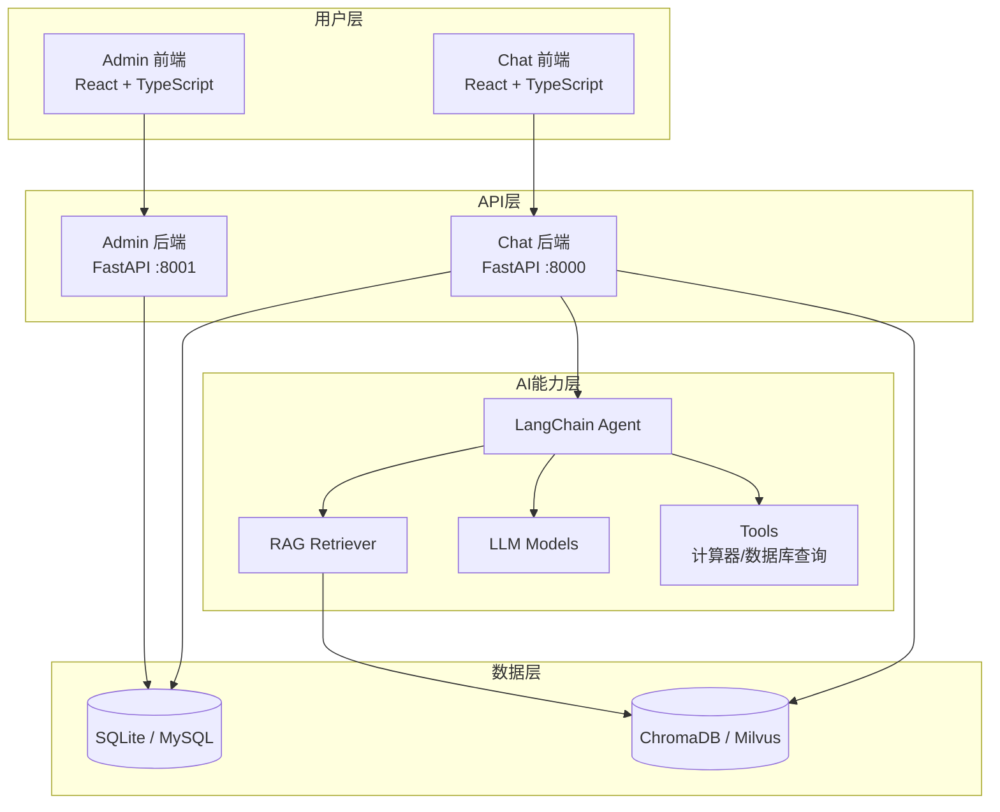

# MGAgent - 企业级智能体系统

:::info 项目概述
**MGAgent** 是一款面向企业场景的智能体系统，基于 [LangChain](https://www.langchain.com/) 框架构建，具备知识库检索、数据分析、多工具调用等核心能力，支持多租户管理和灵活的模型配置。
:::

## 核心特性

### 🎯 智能对话
- 基于大语言模型的自然语言交互
- 支持流式响应，提升对话体验
- 多轮上下文理解，精准把握用户意图

### 📚 知识库检索 (RAG)
- 支持 PDF、TXT、DOCX、MD 等多种文档格式
- 基于向量相似度的智能检索
- 自动文本分割与向量化处理

### 🗄️ 数据库查询
- Agent 自动生成 SQL 查询语句
- 支持表结构查看和数据检索
- 企业业务数据智能分析

### 🔧 多工具调用
- 计算器：处理复杂数值计算
- 知识库检索：查找企业内部信息
- 数据库查询：获取业务数据
- 可扩展的插件化工具架构

### 🔐 多租户权限管理
- 平台管理员、租户管理员、普通用户三级权限体系
- 用户注册审批流程
- 会话数据隔离保护

### ⚙️ 动态模型配置
- 支持配置多种 LLM 模型（OpenAI 兼容接口）
- 一键测试模型连接可用性
- 无需重启即可动态切换模型

## 技术栈

### 后端技术

| 技术 | 版本 | 用途 |
|------|------|------|
| FastAPI | >= 0.100 | 高性能异步 API 框架 |
| LangChain | >= 0.2 | LLM 应用开发框架 |
| SQLAlchemy | >= 2.0 | ORM 数据库操作 |
| PyJWT | >= 2.8 | JWT 认证 |
| bcrypt | >= 4.0 | 密码加密 |

### 前端技术

| 技术 | 版本 | 用途 |
|------|------|------|
| React | 18 | UI 框架 |
| TypeScript | 5 | 类型安全 |
| Tailwind CSS | 3 | 样式框架 |
| Vite | 5 | 构建工具 |
| Axios | 1.6 | HTTP 客户端 |

### 双技术栈支持

| 组件 | 方案一（开发） | 方案二（生产） |
|------|---------------|---------------|
| 关系数据库 | SQLite | MySQL 8.0 |
| 向量数据库 | ChromaDB | Milvus 2.4 |
| 适用场景 | 轻量级单机部署 | 高性能生产部署 |

## 系统架构概览



:::tip 选择建议
- **开发调试**：使用 SQLite + ChromaDB 方案，无需外部依赖，快速启动
- **生产部署**：使用 MySQL + Milvus 方案，支持高并发和大规模数据
:::

## 快速体验

```bash
# 克隆项目
git clone https://github.com/xmgfy/MGAgent.git
cd MGAgent

# 一键生产部署（推荐）
cp .env.production.example .env.production  # 首次配置
./scripts/deploy.sh up

# 或本地开发模式
./scripts/init.sh
./scripts/start-all.sh sqlite
```

## 默认账号

```
管理员账号: admin / admin123
```

## 许可证

MGAgent 采用 MIT 许可证，详见项目 LICENSE 文件。