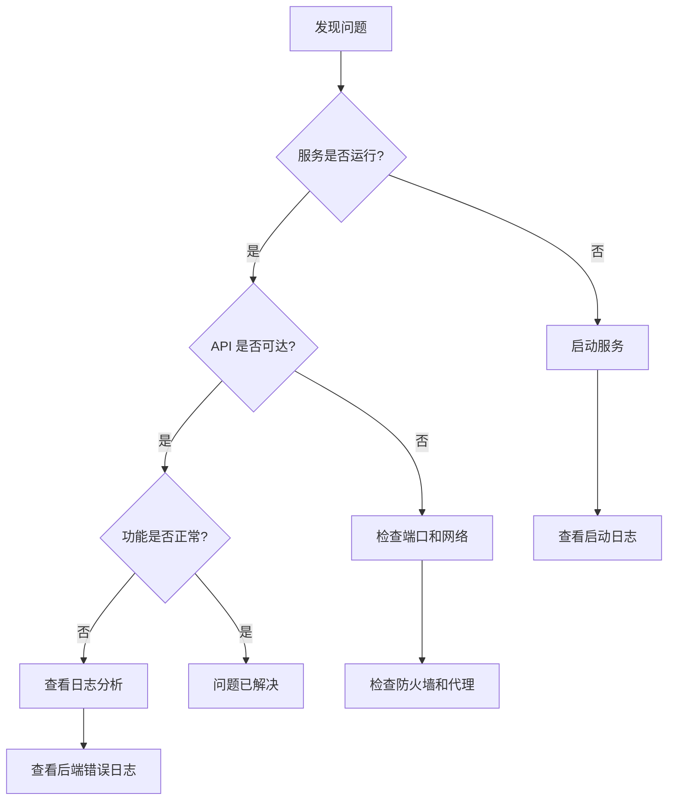

# 故障排查

## 概述

本文档提供 MGAgent 常见问题的详细排查步骤和解决方案。

## 排查流程图



## 服务启动问题

### 服务无法启动

#### 1. 检查前置条件

```bash
# Python 版本
python3 --version  # 需要 >= 3.10

# Node.js 版本
node --version     # 需要 >= 18

# 端口占用
lsof -i :8000 :8001 :5173 :5174
```

#### 2. 查看错误日志

```bash
# 后端日志
cat mgagent-backend/backend.log | tail -50
cat mgagent-admin-backend/admin-backend.log | tail -50

# 前端日志
cat mgagent-frontend/frontend.log | tail -50
cat mgagent-admin-frontend/admin-frontend.log | tail -50
```

#### 3. 手动启动调试

```bash
# 单独启动 Chat 后端
cd mgagent-backend
source .env
python -m uvicorn app.main:app --host 0.0.0.0 --port 8000 --reload

# 查看是否有导入错误或配置错误
```

### Docker 容器不断重启

```bash
# 查看容器状态
docker compose -f docker-compose.prod.yml ps

# 查看崩溃日志
docker logs mgagent-backend --tail=100

# 常见原因：
# 1. 端口冲突 - 修改端口映射
# 2. 数据库连接失败 - 检查数据库服务
# 3. 内存不足 - 增加系统资源

# 重启策略
# restart: unless-stopped  # 异常退出时重启
# restart: always          # 总是重启
```

## 连接问题

### API 不可达

#### 1. 检查端口监听

```bash
# 本地开发
lsof -i :8000
lsof -i :8001

# Docker
docker port mgagent-backend
```

#### 2. 测试 HTTP 连接

```bash
# 本地开发
curl -v http://localhost:8000/api/health
curl -v http://localhost:8001/admin/api/health

# Docker
docker exec mgagent-backend curl -f http://localhost:8000/api/health
```

#### 3. 防火墙检查

```bash
# Linux
sudo ufw status
sudo iptables -L -n

# macOS
sudo /usr/libexec/ApplicationFirewall/socketfilterfw --getglobalstate
```

### 数据库连接失败

#### MySQL 方案

```bash
# 检查 MySQL 容器
docker ps | grep mysql

# 连接测试
mysql -h localhost -P 3306 -u mgagent -pmgagent_password_2024

# 容器内测试
docker exec -it mgagent-mysql mysql -u mgagent -p

# 检查用户权限
mysql> SHOW GRANTS FOR 'mgagent'@'%';
```

#### Milvus 方案

```bash
# 检查 Milvus 健康状态
curl http://localhost:19530/healthz

# 检查依赖服务
docker ps | grep etcd
docker ps | grep minio

# 查看 Milvus 日志
docker logs mgagent-milvus --tail=50
```

### Docker 服务间无法通信

```bash
# 检查网络
docker network inspect mgagent-network

# 确保所有服务在同一网络
docker compose -f docker-compose.prod.yml ps

# MySQL 方案：检查外部网络
docker network ls | grep mgagent
```

## 功能异常

### Agent 不响应

```bash
# 1. 检查模型配置
curl http://localhost:8001/admin/api/model/config

# 2. 检查模型连通性
# Admin 后台 → 模型管理 → 测试连接

# 3. 查看后端日志
tail -f mgagent-backend/backend.log

# 4. 常见错误：
#    - API Key 无效
#    - API Base URL 错误
#    - 模型名称不匹配
```

### 知识库检索无结果

```bash
# 1. 检查向量数据库状态
# Admin 后台 → 向量库管理

# 2. 检查文档是否已索引
# Admin 后台 → 知识库管理

# 3. 手动测试向量检索
# 通过 API 接口测试

# 4. 清除并重建索引
# 使用 Admin 后台的清空功能
```

### SQL 查询报错

```bash
# 1. 检查数据库连接
# 2. 检查表结构
# 3. 检查 SQL 语法
# 4. 查看后端日志获取详细错误

# 启用调试模式查看详细 SQL
# .env 文件设置 DEBUG=True
```

## 性能问题

### 响应缓慢

```bash
# 1. 检查系统资源
top
free -m
df -h

# 2. Docker 资源限制
docker stats

# 3. 数据库连接池
# MySQL: pool_size=10, max_overflow=20

# 4. 向量检索参数
# nprobe 参数影响检索速度
```

### 内存占用高

```bash
# 检查进程内存
ps aux --sort=-%mem | head -20

# Docker 内存使用
docker stats

# 限制容器内存
# 在 docker-compose.yml 中添加：
# deploy.resources.limits.memory: 2G
```

### CPU 占用高

```bash
# 检查 CPU 使用
top -bn1 | head -20

# Docker CPU 使用
docker stats --no-stream

# 调整服务配置
# - 减少并发连接数
# - 优化数据库查询
# - 增加 CPU 核心
```

## 数据问题

### 数据库文件损坏

```bash
# MySQL 修复
mysqlcheck -u root -p mgagent
mysqlcheck -u root -p --repair mgagent
```

### 数据备份与恢复

```bash
# MySQL 备份
mysqldump -u root -p mgagent > backup.sql

# MySQL 恢复
mysql -u root -p mgagent < backup.sql

# Milvus 数据备份（MinIO 持久化层）
docker run --rm -v mgagent_minio_data:/data -v $(pwd):/backup \
  alpine tar czf /backup/minio.tar.gz /data

# Milvus 恢复
docker run --rm -v mgagent_minio_data:/data -v $(pwd):/backup \
  alpine tar xzf /backup/minio.tar.gz -C /

# Docker 卷备份（整体）
docker run --rm -v mgagent_mysql_data:/data -v $(pwd):/backup \
  alpine tar czf /backup/mysql.tar.gz /data
```

## 日志分析

### 日志文件位置

| 日志 | 路径 |
|------|------|
| Chat 后端 | `mgagent-backend/backend.log` |
| Admin 后端 | `mgagent-admin-backend/admin-backend.log` |
| Chat 前端 | `mgagent-frontend/frontend.log` |
| Admin 前端 | `mgagent-admin-frontend/admin-frontend.log` |

### 日志分析命令

```bash
# 查看最近 100 行
tail -100 mgagent-backend/backend.log

# 实时跟踪日志
tail -f mgagent-backend/backend.log

# 搜索错误信息
grep -i "error\|exception\|traceback" mgagent-backend/backend.log

# Docker 日志
docker compose -f docker-compose.prod.yml logs --tail=100
```

### 常见错误日志

```python
# 数据库连接错误
OperationalError: (pymysql.err.OperationalError) (2003, "Can't connect to MySQL server")
# → 检查 MySQL 服务是否启动，连接参数是否正确

# 模型配置错误
ValueError: 未配置有效的模型
# → 在 Admin 后台配置并启用模型

# 向量库连接错误
Exception: Milvus 连接失败
# → 检查 Milvus 服务状态，etcd 和 MinIO 是否正常

# 导入错误
ModuleNotFoundError: No module named 'xxx'
# → 重新安装依赖：pip install -r requirements.txt
```

## 快速恢复

### 完全重置（谨慎使用）

```bash
# 停止所有服务
./scripts/deploy.sh down

# 清理 Docker 数据卷
docker compose -f docker-compose.infra.yml down -v

# 重新启动
./scripts/deploy.sh up
```

### 快速重启

```bash
# 本地开发
./scripts/stop-all.sh
./scripts/start-all.sh

# Docker
./scripts/deploy.sh down
./scripts/deploy.sh up
```

## 联系支持

:::info 获取帮助
如遇到本文档未涵盖的问题：

1. 提交 [GitHub Issue](https://github.com/xmgfy/MGAgent/issues)
2. 发送邮件至 gqq1185805174@gmail.com
3. 附上以下信息：
   - 操作系统版本
   - MGAgent 版本
   - 错误日志截图
   - 复现步骤
:::
